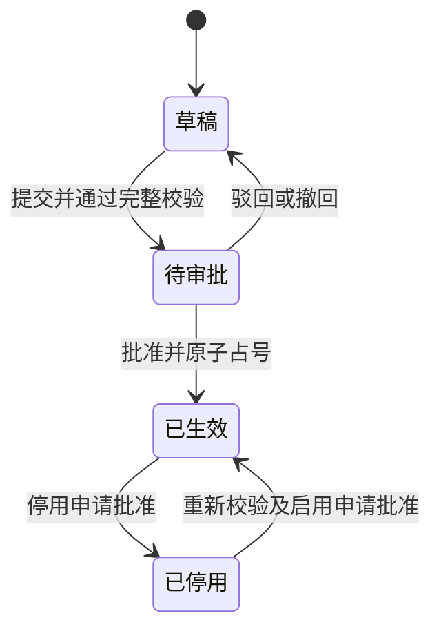
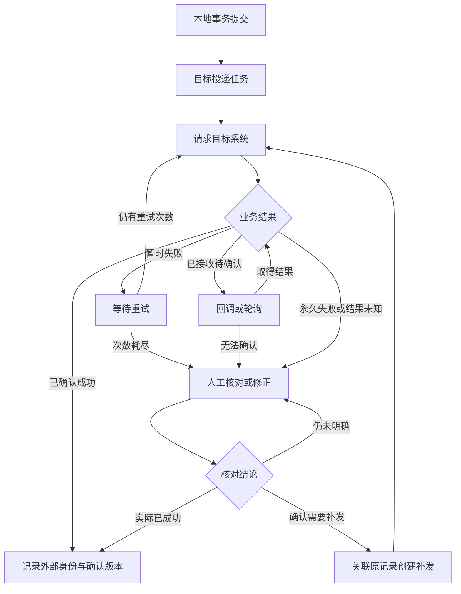
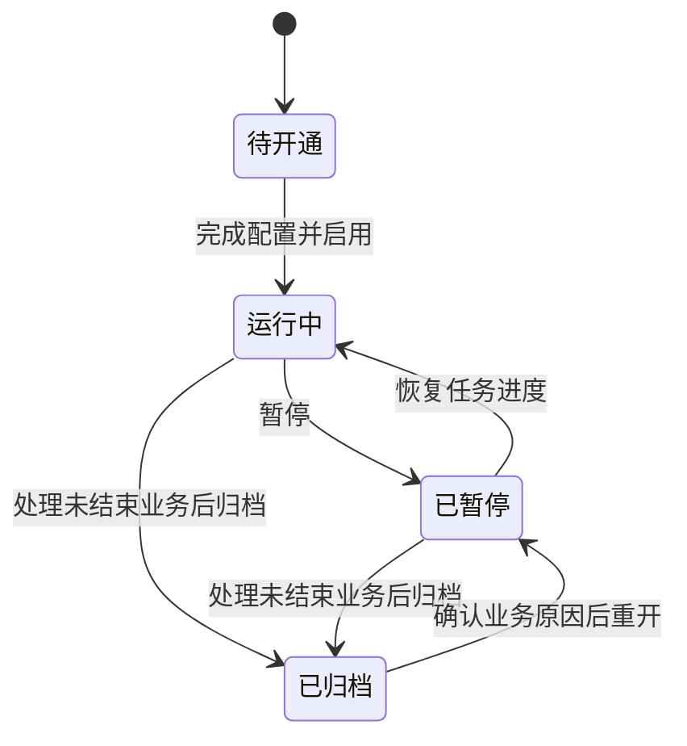

# 通用料号与物料主数据平台

**产品需求文档 PRD**

**版本：V2.0｜状态：评审稿｜业务与多租户管理版**

修订日期：2026年10月6日

基线文档：通用料号与物料主数据平台 PRD V1.0（2026年9月26日）

面向产品评审  研发设计  测试验收  企业集成

本产品以元数据定义不同行业的物料结构，以稳定 UUID 标识物料，以可配置规则生成和解析料号，并通过统一接口与 ERP、MES、PLM、WMS 和企业自研接口平台交换主数据。

本文以 V1.0 为基线，完整定义跨行业物料建模、料号生成与解析、物料生命周期、业务审批、批量导入、企业集成及多租户管理。第一阶段交付可配置、可追踪、可验收的主数据业务闭环；高级 MDM 治理能力作为后续范围。

编制依据：本次上传的《通用料号与物料主数据平台 PRD V1.0》及本次修订要求。本文继承 V1.0 的架构方向，补齐租户生命周期、成员与角色、配置归属、任务归属和多租户验收。

本文为完整 PRD，可用于产品评审、研发设计、任务拆分和测试验收。业务默认值、容量与性能目标、数据保留期及实施安排均为待确认建议；组件版本由项目开工时的技术设计确定。

## 文档导航与使用说明

- [01 产品定位与目标](#01-产品定位与目标)
- [02 发布范围与基本假设](#02-发布范围与基本假设)
- [03 用户角色与业务闭环](#03-用户角色与业务闭环)
- [04 分类与属性元数据](#04-分类与属性元数据)
- [05 Schema 发布与版本兼容](#05-schema-发布与版本兼容)
- [06 校验与派生规则](#06-校验与派生规则)
- [07 料号生成与历史解析](#07-料号生成与历史解析)
- [08 物料生命周期与变更](#08-物料生命周期与变更)
- [09 多租户管理与业务审批](#09-多租户管理与业务审批)
- [10 页面与查询交互](#10-页面与查询交互)
- [11 批量导入与迁移](#11-批量导入与迁移)
- [12 第三方集成与数据归属](#12-第三方集成与数据归属)
- [13 可靠投递与同步工作台](#13-可靠投递与同步工作台)
- [14 对外接口契约](#14-对外接口契约)
- [15 数据模型与一致性约束](#15-数据模型与一致性约束)
- [16 业务操作记录与运行管理](#16-业务操作记录与运行管理)
- [17 非功能指标与数据保留](#17-非功能指标与数据保留)
- [18 验收方案与追踪矩阵](#18-验收方案与追踪矩阵)
- [19 实施计划与交付物](#19-实施计划与交付物)
- [20 风险与待确认决策](#20-风险与待确认决策)

本文件供产品负责人、业务数据管理员、Java 后端工程师、前端工程师、测试人员和集成负责人共同评审。需求编号用于关联研发任务与测试用例，各章可通过本节目录定位。

|章节|内容|阅读重点|
|---|---|---|
|01—03|定位、范围、角色和业务流程|确定做什么以及由谁负责|
|04—07|元数据、规则、编码和解析|确定通用能力的配置边界|
|08—10|物料、多租户、审批、查询和页面交互|确定业务日常操作及租户管理方式|
|11—14|导入、集成、可靠性和接口|确定企业系统对接闭环|
|15—17|数据一致性、业务记录和非功能要求|确定研发约束与运行标准|
|18—20|验收、实施和待确认决策|形成可上线的评审结论|

### 需求标记

P0 为 MVP 上线必须具备的能力；P1 为第二阶段增强能力；P2 为有明确业务需求后评估的能力。FR 表示功能需求，BR 表示业务规则，NFR 表示非功能要求，AC 表示验收用例。

本文沿用 V1.0 的 FR-01—32、BR-01—07 和 AC-01—12 编号，新增 FR-33—38 与 AC-13 用于多租户管理。NFR 在 V2.0 中重新编号；跨版本任务关联应同时记录文档版本。P1 项不作为 P0 发布门槛。

### 版本管理

|版本|日期|主要内容|
|---|---|---|
|V1.0|2026-09-26|首版完整评审稿，定义元数据、编码、物料和集成闭环|
|V2.0|2026-10-06|聚焦业务与多租户管理，补齐租户生命周期、成员、角色、配置和任务边界，更新页面、接口与验收矩阵|

后续按“需求编号、变更前后、影响模块、接口兼容性、测试范围、批准人、计划版本”记录变更。本文不预设实际项目负责人或审批人姓名。

本文的业务规则与租户归属规则优先于示意性接口例子；接口例子不是完整 OpenAPI 文件。数据库表清单为逻辑模型，物理 DDL、索引设计和部署参数在技术设计阶段确定。

## 01 产品定位与目标

### 1.1 背景与问题

不同行业的物料字段差异显著。基板关注品名、厚度和尺寸；玻璃布关注型号、幅宽和厂商；轴承关注内外径、精度和密封类型。为每类物料分别编写业务实体和页面，会导致新增行业必须改代码，料号截取逻辑散落各系统，历史规则难以追溯，ERP 对接随项目反复开发。

产品应把“类别结构、属性类型、业务校验、编码规则和外部映射”作为可发布的配置管理。物料数据是事实来源，料号是受规则约束的业务标识。新业务通过属性查询获取信息；旧料号解析只用于兼容和迁移。

### 1.2 产品目标

|编号|目标|MVP 衡量方式|
|---|---|---|
|G01|跨行业配置复用|配置玻璃布和轴承，不新增行业实体、业务列或专属接口，完成创建与查询|
|G02|数据解释稳定|所有正式物料绑定 Schema 和规则版本，历史查看结果不被新配置覆盖|
|G03|料号可靠生成|并发及重试用例中重复正式料号为零；预览不消耗流水|
|G04|集成可恢复|一个真实目标系统完成创建、变更、失败重试和对账闭环|
|G05|业务可追踪|正式写入均可关联操作者、版本、审批依据和同步结果|
|G06|多租户可独立管理|两个租户独立维护成员、类别、规则、物料、导入和集成；支持切换、暂停及恢复|

这些是发布验收目标，不是收益预测。上线后按月观察物料创建耗时、首次校验通过率、导入行成功率、同步业务成功率及人工处理积压；先采集基线，再制定改善比例。

### 1.3 系统边界

系统管理物料身份、规格属性、分类规则、生命周期和外部身份映射。库存数量、库存交易、成本核算、采购订单、完整 BOM 维护和供应商资质审批由相应业务系统负责。仅按明确的数据归属规则引用这些系统，不扩展成完整 ERP。

## 02 发布范围与基本假设

### 2.1 分期范围

|能力|P0 本期|后续范围|
|---|---|---|
|模型配置|租户、类别、单值属性、字典、单位、引用、不可变版本|P1 多值、对象、数组和模板市场|
|规则引擎|条件必填、显示、基础派生、编码、显式版本解析|P1 自动候选识别与复杂决策|
|物料管理|草稿、审批、生效、变更、停用、历史和搜索|P1 批量 Schema 迁移与重编码|
|导入导出|CSV/XLSX 暂存、预检、行错误、确认提交、查询导出|P1 超大文件及调度导入|
|第三方集成|REST 入站出站、字段映射、Outbox/Inbox、重试、对账|P1 专有 ERP 连接器、消息总线和 CDC|
|租户与业务管理|租户生命周期、成员与角色、类别范围、数据归属、业务操作记录和版本冲突|P1 复杂组织范围、配额；P2 匹配合并、Golden Record、血缘和质量评分|

### 2.2 本期约束

继承 V1.0：采用模块化单体；数据库以 PostgreSQL 为基线；缓存可用 Redis；Kafka、Debezium、OpenSearch 和 BPMN 引擎均不作为首版必须依赖。

补充默认值：前端建议 Vue 3 动态表单；服务端 Java / Spring Boot。具体 JDK、框架和组件版本由技术负责人在开工前按公司依赖矩阵锁定，不依据“最新版”直接立项。

多租户能力保留，单公司部署可仅配置一个租户。类别树用于组织导航，每个可建物料的叶子类别绑定独立 Schema；MVP 不做父子属性自动继承或多分类共同决定结构。

本期至少接通一个真实 ERP 或自研接口平台。通用 HTTP 映射不能替代所有厂商的业务接口适配；目标系统须提供接口文档、测试环境、业务成功判定和联调条件，完成业务验收后才计入已支持清单。

### 2.3 立项前提

有可用数据库、文件存储和部署环境，确定业务用户来源及租户成员维护方式；业务方提供两类物料样本、编码说明、审批角色和目标接口。V1.0 中约4—5个全职当量、12—16周的安排继续作为条件性估算，正式排期见第19章。

## 03 用户角色与业务闭环

### 3.1 角色与职责

|角色|允许的主要操作|约束|
|---|---|---|
|平台管理员|租户开通、暂停、恢复、归档及平台运行配置|平台管理岗位与租户业务岗位分别配置|
|租户管理员|租户信息、成员、角色、类别范围、引用源与集成系统|已发布配置通过新版本变更|
|模型设计员|属性、Schema、编码及解析规则草稿|发布需指定审核角色批准|
|物料编辑员|物料草稿、提交、导入和变更申请|不得审批自己提交的申请|
|物料审批员|查看差异、批准、驳回、停用审核|仅操作授权类别|
|集成管理员|映射、投递、补发、对账和异常处理|仅处理当前租户的集成系统和任务|
|只读用户或集成客户端|分配范围内查询和订阅|按租户、角色动作和类别范围管理|

岗位可兼任，但同一申请不能自审。业务与配置发布均执行此规则；提交前须能找到具备对应类别范围的审批人。平台管理员若参与业务处理，应另行加入对应租户并分配业务角色。

### 3.2 主要用户故事

US01：模型设计员希望通过配置新增玻璃布类别、幅宽和厂商引用，以便无需发版支持新物料。

US02：编辑员希望录入规格后看到校验结果和候选料号，提交审批后获取稳定 UUID 与正式料号。

US03：审批员希望看到变更前后和规则版本，避免已使用物料被无意改义。

US04：集成管理员希望失败时定位具体字段、重试结果和目标业务单号，避免人工重复创建 ERP 物料。

US05：租户管理员希望独立维护本租户成员、角色、类别范围和业务设置，使人员调整不会改变历史物料与审批记录。

US06：平台管理员希望查看各租户状态和任务积压，并能暂停、恢复或归档租户，使租户运营变化不会重复执行已有任务。

### 3.3 端到端流程

配置草稿经审核发布后，用户选择类别并锁定版本，录入、校验、预览、保存草稿和提交。审批通过时正式占号，提交权威记录、同步投影、业务操作记录和出站事件；投递任务按映射发送目标系统。界面分别显示业务生效状态和每个目标系统的同步状态。

旧资料经过上传暂存、映射或解析、校验和人工确认，进入相同的草稿与审批流程，不直接旁路写入正式主数据。

## 04 分类与属性元数据

### 4.1 功能要求

FR-01 P0：类别支持创建、重命名、树形移动、启停和授权。类别 code 在租户内唯一且启用后不可修改；移动节点不改变 Schema。存在物料或已发布版本时禁止硬删除，停用后禁止新建，历史可查。

FR-02 P0：属性以稳定 code 表达语义，支持名称、描述、类型、长度或精度、范围、单位维度、默认值、字典、引用目标、搜索排序标记和显示分组。属性语义改变必须新建版本；类型含义改变建议新 code。

|类型|录入与校验|本期约束|
|---|---|---|
|STRING|文本、最大长度、正则|建议最大1000字符，具体由 Schema 限制|
|INTEGER|整数、上下限|不接受小数或隐式截断|
|DECIMAL|十进制数、精度和单位|BigDecimal 等价语义，不用浮点比较唯一性|
|BOOLEAN|真或假|false 为有效值，不等于缺失|
|DATE|日期控件|YYYY-MM-DD，不附带时区|
|ENUM|单选字典 code|不使用显示名称做持久身份|
|REFERENCE|选择引用实体 ID|引用对象必须属于允许的租户及目标类型|

### 4.2 复用和字典

FR-03 P0：属性定义可被多个类别复用，但已发布 Schema 应固定属性版本。类别级只允许覆盖显示顺序、分组、必填和约束收紧；不得改变原属性类型或单位维度。

FR-04 P0：字典项以 code 唯一，停用后不得新选，已有物料保留原值及当时的解释信息。字典、单位转换和编码查找表中影响语义的内容随发布形成版本快照。引用名称可展示当前值，历史页面同时提供当时名称快照。

验收 AC-01：修改属性草稿名称或停用字典项，已有 Schema 的校验语义及历史物料快照不变；引用其他租户的私有对象时返回归属冲突。

## 05 Schema 发布与版本兼容

### 5.1 配置与发布

FR-05 P0：编辑器分别维护数据 Schema 和 UI Schema，支持字段顺序、分组、必填条件和预览。JSON Schema 用于服务端结构校验，UI Schema 用于控件及布局，隐藏字段仍须服从完整业务校验。

发布包包含属性版本、校验规则、派生规则、编码规则、字典及单位语义版本、UI Schema 和回归样本。只有完整发布包通过依赖检查和样本回归后才能生效。

|状态|可执行动作|进入条件|
|---|---|---|
|DRAFT 草稿|编辑、测试、删除未引用草稿、提交|设计员创建或从旧版本复制|
|REVIEW 待审|批准、驳回、撤回|编译成功且样本测试全通过|
|PUBLISHED 已发布|只读、设为新建默认版本、停用|审核人与提交人不同|
|RETIRED 已停用|历史解释与查询|停止用于新建，不删除快照|

驳回或撤回返回 DRAFT。发布后不允许原地编辑。错误修复通过新版本发布；旧版重新作为默认新建版本须重新审批其启用，不改变版本内容。

### 5.2 新旧数据处理

BR-01：创建表单打开时固定 schemaVersionId；提交时必须携带该 ID。若默认版本已变化但原版仍允许新建，继续按原版提交并提示；若已停用，阻止提交，展示升级差异并要求重新校验。

FR-06 P0：发布前显示影响类别、存量数量、字段新增删除及类型变化。新增必填、缩窄范围、变更单位语义、删除枚举均视为潜在不兼容，不能自动修改旧物料。

本期存量数据继续用原 Schema；单条迁移可由变更申请明确指定目标 Schema 并重新校验，涉及编码属性变更仍受第08章限制。P1 才提供批量迁移预演、审批、分批执行和失败恢复。

验收 AC-02：v1 物料在 v2 发布后仍按 v1 展示和校验；v2 新增必填不使 v1 历史变为非法；发布后修改接口应被拒绝。

## 06 校验与派生规则

### 6.1 规则执行约定

FR-07 P0：规则以结构化表达式 AST 配置，提供 eq、ne、gt、gte、lt、lte、in、and、or、not、exists 及基本四则运算。P0 仅支持这些业务运算及已登记的属性、字典、引用与单位函数；新增运算类型通过产品版本扩展。

处理顺序：检查输入形状与类型；执行单位规范化；补充默认值；按依赖顺序计算派生值；执行完整 Schema、条件、引用和业务校验；通过后方可预览编码或提交。默认值含单位时同样先规范化。

BR-02：PATCH 未出现字段表示保持原值；显式 null 表示清空可空字段。必填不接受 null；空字符串、零、false 的含义由类型定义，不做统一“空值”判断。派生属性只读，客户端伪造派生结果应返回错误。

BR-03：visibleWhen 只控制显示，不自动清除已存值；requiredWhen 独立决定必填。当字段隐藏但需填写时应提示配置冲突；发布检查拦截可静态发现的矛盾。服务端始终校验所有传入字段。

### 6.2 数值与单位

FR-08 P0：DECIMAL 按量纲转换并保存标准值、标准单位和原始输入用于业务追溯。仅允许同量纲转换；纯数值量可不带单位。中间运算不提前四舍五入，存储精度与输出格式分别定义；精度溢出默认拒绝，不静默取整。

派生示例：宽1020 mm、长1220 mm，面积为1244400 mm²，若展示为m²则为1.2444 m²。缺少依赖时返回依赖字段错误；除零或循环依赖不得继续生成料号。温度等带偏移单位的规则需显式配置，不沿用纯倍数算法。

### 6.3 错误与规则质量

返回 errors 和 warnings；error 阻止提交，warning 允许继续但须展示。每条错误包含 fieldPath、code、message、ruleVersion 和可读修正建议，技术异常与业务字段错误分别记录。

发布时检查依赖环、未知字段、正则有效性及执行耗时。建议单次规则执行预算100 ms、AST 节点上限200，超限中止并记录规则 ID；最终阈值需压测确认。

AC-03：提交错误单位、缺失条件必填、除零和循环派生样本均被阻止；网页与 API 对同一规范化输入返回相同业务结论。

## 07 料号生成与历史解析

### 7.1 编码能力

FR-09 P0：按顺序组合常量、属性、字典映射和流水段，支持分隔符、数值格式、单位转换。整条料号最大128字符，租户内唯一。允许字符集、大小写和前后空白处理规则在租户初始化时固定；禁止静默截断。

默认使用大小写敏感唯一性，并保留录入形式；企业如需忽略大小写，必须在上线前确定统一规范化策略及唯一索引。禁止以后通过修改显示设置改变已有料号的唯一性含义。

FR-10 P0：预览返回候选段明细和“未占用”标记，流水段显示占位符。正式料号仅在首次批准生效时原子占用。草稿已有 UUID，但 materialNo 为空；不要求草稿表中的料号非空。

BR-04：流水号作用域固定为租户、规则、序列名及周期；本期默认永不重置。确需每日或每年重置时，周期标记必须进入料号，且时区固定。允许因事务失败产生断号；已发放号码不回收。容量耗尽直接报错并提示管理员扩展序列规则，不能回绕。

BR-05：无流水规则遇同号返回 CODE_CONFLICT，并提供有权查看的冲突记录入口；不得自动追加后缀。同一幂等请求重试返回原结果，不再占号。

### 7.2 历史料号

FR-11 P0：用户明确选择解析规则及版本后执行正则或固定段解析。结果包含提取属性、规则版本、未解析段、校验错误和匹配类型；精确匹配仅指语法匹配，不代表业务真实性。

解析本身不创建或更新物料。输入列与解析属性矛盾时记录冲突，要求人工选择并保留来源。无法解析进入人工补录。P1 可自动筛选候选规则；多候选必须返回 PARSE_AMBIGUOUS，禁止猜测。

FR-12 P0：历史导入可申请保留原料号，需专门权限与审批，标记编号来源 LEGACY；仍检查格式、唯一性和属性有效性。不存在编码规则版本时明确为空，并记录实际解析规则版本，不伪造生成历史。

AC-04：100并发不同申请批准不重号；相同请求重试不新占号；无流水同码冲突不被自动“修正”。

## 08 物料生命周期与变更

### 8.1 核心行为

FR-13 P0：提供新建、草稿保存、复制、提交、详情、变更申请、停用与重新启用。复制仅复制可编辑属性，不复制 UUID、料号、外部身份、审批记录及同步状态。

草稿允许缺少业务必填，但不允许未知字段、非法类型或其他租户的数据引用；提交执行完整校验。正式物料不能硬删除，只有无历史业务关联的草稿可删除，并记录删除操作。

|对象状态|动作|结果|
|---|---|---|
|DRAFT 草稿|提交申请|进入 IN_REVIEW 待审批|
|IN_REVIEW 待审批|批准首次生效|占号并成为 ACTIVE；发生冲突则审批不成功|
|IN_REVIEW 待审批|驳回或撤回|回到 DRAFT，保留意见|
|ACTIVE 生效|申请变更|旧正式版本继续有效，另建变更申请|
|ACTIVE 生效|停用申请获批|变为 INACTIVE 并产生事件|
|INACTIVE 停用|重新启用获批|重新校验后 ACTIVE，沿用原 UUID 和料号|

### 8.2 编码相关属性

BR-06：正式生效后，本期禁止直接修改会改变料号含义的编码属性，包括其派生依赖和编码引用快照。规格确实改变应新建物料，可建立“替代物料”关系并按需停用旧物料。名称等非编码属性可经变更审批更新。

P1 重编码需设计旧号别名、旧号不可复用、外部映射更新与全链路通知；本期不开放“编辑料号”入口。因配置迁移造成编码含义变化的申请同样禁止。

### 8.3 版本与并发

FR-14 P0：每次持久业务写入递增 rowVersion，审批的候选数据单独记录 baseVersion。提交和批准均检查版本；若正式记录已变化，返回 VERSION_CONFLICT，要求重新比较和提交，不覆盖其他人的修改。

历史查看包括完整快照、差异、原因、操作者及关联请求。恢复历史只允许以其非编码属性发起新的变更申请，不能把版本号倒退或直接覆盖当前数据。

AC-05：两人基于同一版本编辑，后提交者收到冲突；审批期间查询仍返回旧正式版本；停用物料仍可按 UUID 查询但不能用于新的业务引用。

## 09 多租户管理与业务审批

### 9.1 租户生命周期

FR-33 P0：平台管理员可新建租户、编辑基础信息、启用、暂停、恢复和归档。租户维护稳定 tenantId、唯一 tenantCode、名称、状态、联系人、默认时区及创建时间。tenantCode 启用后不可修改；名称可变更，已有业务引用继续使用 tenantId。

|租户状态|业务操作|任务行为|
|---|---|---|
|DRAFT 待开通|配置基础信息与初始管理员|不处理物料和集成任务|
|ACTIVE 运行中|按成员角色开展完整业务|导入、审批和投递正常运行|
|SUSPENDED 已暂停|查看存量数据与历史，暂停新增及修改|暂停后续批次和新投递，保留进度|
|ARCHIVED 已归档|查看保留数据、导出和历史|停止新的业务任务，保留结果|

新租户从 DRAFT 启用为 ACTIVE；ACTIVE 可暂停，SUSPENDED 可恢复。归档前须处理或取消未结束申请，明确待确认的外部请求和数据保留方案。已归档租户重新开通时，由平台管理员确认业务原因，先恢复为 SUSPENDED，再按恢复流程启用为 ACTIVE，并记录两次状态变更。P0 不提供租户及其正式主数据的整体硬删除。

暂停不强行中断已进入本地事务的动作；该事务完成后停止后续处理。对正在发送的外部请求保留实际结果，结果未知时进入核对流程。恢复后从持久化任务进度继续，已成功行和投递记录不重复执行。

### 9.2 成员、角色与当前租户

FR-34 P0：租户管理员可新增成员、关联已有业务用户、启停成员及分配角色。业务用户与租户成员分开建模，一个用户可加入多个租户，在各租户拥有不同角色和类别范围。移除成员只结束其当前业务任职，历史申请和操作记录保留原操作者信息。

FR-35 P0：进入业务页面时必须明确当前租户。用户可在其成员列表内切换，页面持续展示当前租户名称。切换后清空原租户的表单、列表、查询条件和待办上下文；已提交任务继续归属原租户，在原租户任务中心查看。存在未保存表单时先提示保存或放弃。

平台管理端负责租户信息与运行状态，租户业务端负责主数据操作。平台管理员的岗位本身不产生租户业务角色；参与某租户业务时，使用该租户已分配的成员身份。

### 9.3 业务权限与类别范围

FR-16 P0：业务操作范围由“当前租户成员状态＋角色动作＋类别范围”共同决定。动作至少区分查询、新建、编辑草稿、提交、审批、配置设计、配置发布、导入、导出和集成管理。租户管理员负责成员、角色及类别范围配置；组织字段预留，复杂组织层级继承和行级表达式范围为 P1。

列表、详情、搜索、导出、历史、解析候选、冲突记录和审批待办使用同一租户及类别范围。单纯隐藏页面按钮不能替代后台范围判断。角色或类别范围变更后，后续业务动作使用当前配置，既往记录保持原状。

FR-36 P0：类别、属性、字典、引用源、发布包、规则、物料、导入任务、集成系统、映射、外部身份、投递和对账均明确所属租户。缓存键、任务记录、文件元数据和查询投影包含租户维度。同一料号、类别 code 或外部 ID 可在不同租户独立存在；跨租户查询、更新和私有引用返回租户归属错误。

P0 采用共享数据库与 tenantId 逻辑分区，业务唯一键包含 tenantId。租户私有配置及引用不自动共享。系统内置单位等公共基础数据单独定义公共来源，只读使用；跨租户模板复用通过复制形成目标租户草稿，再按目标租户规则发布，不把源租户业务记录直接关联进来。

### 9.4 租户业务配置与运行概览

FR-37 P0：租户可维护默认时区、展示单位、默认查询页数、导入导出上限、数据保留参数、业务管理员与集成联系人。租户策略可在平台支持范围内收紧；影响料号唯一性或历史数据解释的配置按版本规则管理，不能通过普通设置覆盖已发布语义。

FR-38 P0：平台租户列表展示状态、成员数、物料数、待处理导入任务数、待投递数量及最近业务活动时间。租户工作台展示本租户的草稿、待审、导入与同步概览。平台运行统计为汇总指标；进入具体业务内容仍按租户成员及业务角色处理。P1 可增加租户配额、容量提示与使用量报表，P0 不包含订阅计费。

### 9.5 审批要求

FR-15 P0：按类别配置单级审批人角色，支持待办列表、详情差异、批准、驳回和申请人撤回。提交后申请内容冻结；修改须撤回再提交。所有正式新建、变更、停用和重新启用默认需要审批，配置发布也执行审核流程。

审批角色和申请对象归属同一租户。同一申请的提交人不能作为最终审批人；具备多个角色的用户也执行这一业务分工。集成客户端创建默认进入草稿，自动生效作为后续独立业务策略评审。

审批意见：驳回必填，批准可填，停用和变更申请必须填写原因。批量导入按批次展示汇总与逐行差异，最终每行独立重新校验并生效。

|校验项|审批时检查|失败反馈|
|---|---|---|
|租户状态|租户运行中，成员可处理业务|提示暂停或成员状态变化|
|业务范围|审批人具有对应动作和类别范围|提示角色或类别范围不匹配|
|业务分工|审批人不是提交人|提示需要其他审批人|
|版本|正式记录版本与申请 baseVersion 一致|冲突，要求重新提交|
|引用状态|供应商等引用对象仍有效且归属一致|定位失效引用或归属冲突|
|规则状态|指定版本仍允许该业务动作|提示升级或重新审核|
|唯一性|料号及业务唯一键可占用|保持待处理并返回冲突|

### 9.6 通知与异常

审批待办采用站内任务计数；外部邮件与即时通信通知不纳入 P0。无其他可用审批人时阻止提交并提示联系租户管理员；示例及单公司部署至少配置两名可承担相应业务分工的成员。待办可按审批角色重新分配，保留变更记录；人员调整不改变既往审批结果。

AC-06：申请人自审失败；类别范围变化后审批动作按当前范围执行；并发批准同一申请最多产生一次正式版本和一次对应业务事件。

AC-13：一个用户加入两个租户后可切换且具有各自角色；两个租户可创建相同料号；各自的类别、私有引用、任务、文件、设置和集成记录独立；概览计数与实际记录一致；暂停、恢复及归档重开不重复执行已完成任务。

## 10 页面与查询交互

### 10.1 页面清单

|页面|主要信息与操作|关键状态反馈|
|---|---|---|
|工作台|当前租户、我的草稿、待审、同步失败、导入任务|按业务范围计数，空状态提供下一步入口|
|平台租户管理|租户列表、创建、启用、暂停、恢复、归档与运行统计|展示状态及未结束任务，变更有结果反馈|
|租户设置与成员|基础配置、成员、角色、类别范围与联系人|明确当前租户，人员变动保留历史|
|物料列表|料号、名称、类别、状态、版本、更新时间|动态筛选、排序、分页、保存查询、导出|
|物料表单|类别、版本、分组属性、单位、校验和预览|错误定位到字段，未保存离开需确认|
|物料详情|正式属性、版本、历史、申请和同步标签|明确显示草稿或正式版本，停用原因可见|
|模型配置|类别、属性、字典、Schema、规则样本|草稿编辑与已发布只读严格分开|
|审批中心|待办、差异、意见、批准或驳回|显示 baseVersion 与重新校验失败原因|
|导入中心|文件、映射、预检、提交、结果下载|行级进度与可重试范围|
|集成中心|系统、映射、连接测试、投递、对账|业务成功与 HTTP 成功分开|

### 10.2 查询要求

FR-17 P0：支持料号精确查找、名称关键字匹配、类别、状态、更新时间及已配置可搜索属性过滤。按类型提供 EQ、IN、BETWEEN、GTE、LTE 等合法操作；MVP 动态条件为 AND 组合，不提供任意 SQL 或复杂嵌套表达式。

默认每页50条、最多200条；按 updatedAt 和 UUID 稳定排序，后续页使用不透明游标。新增或变更可能影响实时列表；导出需固定查询截止时间与筛选条件，记录导出任务信息。

跨类别搜索仅允许核心字段；需筛选行业属性时先选择类别。排序属性必须声明 sortable；未知字段、非法运算符和类别范围不匹配返回结构化错误。

FR-18 P0：导出 CSV/XLSX 复用当前租户、类别范围和筛选条件，超过同步阈值转后台任务。导出文件归属原任务租户，提供字段选择、单位说明、查询截止时间和行数。建议单次上限5万行，可由租户策略收紧；任务完成后在对应租户导出中心下载。

### 10.3 通用交互

请求处理中禁用重复提交，但服务端仍负责幂等。网络超时时显示“结果待确认”，通过请求 ID 查询原结果。空列表、业务范围不匹配、版本冲突和外部服务异常应分别提示，不能统一显示“无数据”。

AC-07：表单与接口使用同一 Schema；非法搜索字段拒绝；列表、详情、导出与历史使用相同租户及类别范围。

## 11 批量导入与迁移

### 11.1 导入流程

FR-19 P0：CSV 使用 UTF-8；XLSX 选择一个工作表。本期建议上限20 MB、5万行、200列，上传前展示限制；导入读取单元格业务值，公式单元格需先转换为确定值。文件校验后进入所属租户的暂存区。

导入任务依次经过 UPLOADED、VALIDATING、READY、COMMITTING、COMPLETED 或 PARTIAL_FAILED；不可恢复系统错误为 FAILED。确认前可取消为 CANCELLED；提交后取消只停止尚未处理的行，保留已提交结果。租户暂停或管理员暂停时进入 PAUSED，保存暂停原因及此前阶段，恢复后继续该阶段。界面显示成功、失败、跳过、待处理行数，计数之和必须等于有效数据行数。成功行表示已创建草稿或申请，不表示审批已通过或 ERP 同步已成功；审批与同步结果分别展示。

FR-20 P0：用户选择类别、Schema、创建或更新模式、列映射、单位和解析规则。提供样例预览但确认前必须完成全量预检；模板记录规则版本和源文件校验摘要，执行期间不随配置变化。

更新模式必须提供 UUID，或“外部系统＋外部 ID”；只有料号时先显式解析为 UUID。缺少身份不得猜测更新对象。若提供多个身份且指向不同物料，应报冲突。导入不改变编码属性保护规则。

### 11.2 提交语义

BR-07：预检不创建正式物料、不占号、不发送主数据事件。用户可确认“仅提交通过行”；有错误的行保留待修正。确认提交创建草稿或变更申请，经审批后再正式生效。

按行提交事务，批处理可分块执行；不承诺整文件原子成功。提交时再次检查租户状态、业务范围、版本、引用和唯一性。中断后从持久化行状态恢复，同一任务同行最多生成一个申请；跨文件重复依靠业务唯一键和外部身份识别。

取消仅阻止尚未执行的行，已提交申请不自动删除，已生效物料不自动回滚。更正通过新变更申请处理。

### 11.3 错误与迁移对账

FR-21 P0：错误报告含行号、源列、目标属性、错误码、原值和修正建议；报告在所属租户任务中心下载，采用任务对应的类别范围。只重试修正后的失败行，不重放成功行。

迁移步骤为样本清洗、全量预检、业务确认、冻结旧系统相关写入窗口、分批提交审批、总数及关键字段对账、增量补齐和切换。旧号无法解析的记录进入人工队列，禁止凭猜测补值。

AC-08：含有效、非法、重复及版本冲突行的文件，预检不污染主表；中途重启后恢复不会重复创建；所有源行有可核验处理结果。

## 12 第三方集成与数据归属

### 12.1 连接配置

FR-22 P0：每个租户独立维护集成系统 code、名称、方向、环境、接口地址、接口类型、超时、发送频率、映射版本和联系人角色。支持 REST 入站、REST 出站及文件批量；按目标接口约定配置业务操作、响应字段与结果查询方式。

集成系统及客户端固定归属一个租户。一个外部平台服务多个租户时，分别创建租户连接和映射，不共用任务、外部身份或投递进度。启用连接前完成连接测试、字段映射测试和目标业务错误样本测试。

FR-23 P0：映射支持字段路径、常量、字典映射、单位转换和有限格式转换。发布版本不可变，提供输入输出预览、必填覆盖检查和回归样本。映射缺项应失败，禁止静默丢弃关键字段。

### 12.2 字段归属

|字段类别|建议权威系统|其他系统写入策略|
|---|---|---|
|UUID、料号、Schema 版本|本平台|REJECT，禁止外部覆盖|
|名称、规格和技术属性|本平台|通过申请审核，默认 REVIEW|
|物料启停状态|立项时选定一个权威系统|非权威来源 REVIEW|
|成本、库存、采购提前期|ERP/WMS|不作为本期主数据可编辑字段|
|BOM 和供应商资质|PLM/ERP/SRM|仅引用，禁止双向覆盖|

FR-24 P0：按“系统＋类别＋字段”配置 ACCEPT、IGNORE、REJECT、REVIEW。ACCEPT 仅表示接收进入所属租户的申请流程，仍执行审批；IGNORE 必须记录忽略字段，REJECT 使整条请求失败，REVIEW 生成冲突待办。不能用最后写入者自动获胜。

### 12.3 外部身份与防回环

FR-25 P0：外部身份唯一键为 tenantId、systemId、externalId，且同一目标系统每个物料默认只绑定一个有效外部 ID。绑定变更必须记录操作和原因，冲突进入人工核对。

入站保存 sourceSystem、sourceMessageId、correlationId；出站按来源和实际变更内容抑制无意义回发。外部源版本不得直接写入本平台 rowVersion；若目标无版本机制，接入方须通过身份去重和对账补足。

AC-09：用同一份物料配置两套不同字段映射，无须修改物料领域代码；非法所有权修改及外部 ID 冲突均被阻止并可定位。

## 13 可靠投递与同步工作台

### 13.1 事务与状态

FR-26 P0：首次生效、正式变更、停用和重新启用时，将权威记录、主库搜索投影、业务操作记录及 Outbox 在同一事务中提交。MVP 由后台任务轮询 Outbox 并调用 REST，无需 Kafka；不得先调用 ERP 再提交本地事务。

事件 eventId 全局唯一，包含 tenantId、materialId、rowVersion、previousPublishedVersion、eventType、occurredAt、schemaVersion、变更字段、来源和 traceId。保留该业务版本的可重放快照，避免重试时读取“当前最新值”而误代表旧事件。

每个目标系统独立维护 deliveryId、eventId、mappingVersion、尝试次数、最近错误和目标业务标识。一个目标失败不阻止其他目标，也不撤销本地已生效状态。

|投递状态|含义|后续动作|
|---|---|---|
|PENDING|已提交待发送|后台领取任务|
|SENDING|处理中且持有租约|超时后可恢复领取|
|RETRY_WAIT|暂时失败待重试|到期重新发送|
|WAIT_CONFIRMATION|目标已接收，等待最终业务结果|回调或轮询确认，不重新创建|
|RESULT_UNKNOWN|请求结果不明确|查询目标或人工核实后继续|
|SUCCEEDED|目标业务处理成功|记录外部 ID 与确认版本|
|FAILED|不可重试或次数耗尽|进入人工工作台|

### 13.2 幂等与乱序

FR-27 P0：同一目标同一物料按 rowVersion 顺序投递；旧版本不能覆盖新版本。处于 WAIT_CONFIRMATION 或 RESULT_UNKNOWN 的任务需先确定结果，再推进该物料的后续版本；不同物料可独立继续。previousPublishedVersion 标识上一正式业务事件的物料版本，首次生效时为空。接收端发现该前序版本尚未确认时，暂缓处理并补取对应正式快照或执行对账；草稿保存及提交导致的 rowVersion 跳号不视为缺失业务事件。

入站 Inbox 的去重记录与本地业务更新在同一事务中提交。链路语义为至少一次投递与幂等处理。HTTP 200 只有在适配器确认业务成功时才算成功；HTTP 202 进入 WAIT_CONFIRMATION，需回调或轮询取得最终结果；业务确认超时且无法判定结果时进入 RESULT_UNKNOWN。确认轮询的间隔与最长等待时间按目标系统单独配置。

### 13.3 重试与人工恢复

FR-28 P0：超时、429及5xx按1分钟、5分钟、30分钟、2小时最多自动重试4次（不含首次发送），429优先遵守合理的 Retry-After。校验、映射、目标接口配置及大多数4xx直接进入人工处理。禁止无限重试。

超时可能已成功，必须带目标幂等键或按外部业务身份查询；目标两者均不支持时标记 RESULT_UNKNOWN 并人工核实。默认重试固定原映射版本；修复映射后发起新投递修订并关联原记录，不篡改历史。

FR-29 P0：提供手工及每日对账，比较外部身份、最近确认版本和关键字段摘要，形成差异清单；补发按集成管理员的租户与系统范围执行。事件、幂等记录保留期见第17章。

AC-10：事务后进程崩溃、ACK 丢失、重复事件及乱序事件均不丢数据或重复创建，工作台可追踪最终状态。

## 14 对外接口契约

### 14.1 公共 API

接口前缀为 /api/v1；后台配置接口与公共接口分别出具 OpenAPI。结构错误400、业务范围不匹配403、当前租户内资源不存在404、版本或幂等冲突409、业务校验422、缺少版本条件428、目标服务繁忙429、依赖异常503。PRD 的 V2.0 为文档版本，沿用 /api/v1 并不表示已经发布 API 主版本2。

|方法|相对路径|语义|
|---|---|---|
|GET|/tenants/current|获取当前租户、成员角色与业务范围|
|GET|/me/tenants|获取本人可切换的租户列表|
|GET|/categories/{code}/schema|获取明确版本；省略时返回当前默认及其 ID|
|POST|/materials:validate|规范化并校验，不持久化|
|POST|/material-numbers:preview|预览，不占号|
|POST|/material-numbers:parse|按指定规则版本解析|
|POST|/materials|建立草稿，返回201、UUID 和版本|
|GET|/materials/{id}|获取授权范围内当前记录|
|GET|/materials/by-no?no=…|按料号查询，参数须编码|
|POST|/materials/search|按类型过滤和游标分页|
|PATCH|/materials/{id}|仅更新草稿，必须携带 If-Match|
|POST|/materials/{id}/change-requests|正式物料创建变更申请|
|POST|/requests/{id}/submit 或 /approve|提交或审批；动作权限独立|
|POST|/import-jobs|建立异步任务，返回202与任务 ID|
|GET|/materials/{id}/history|按权限查看版本历史|

平台管理端另提供租户创建、启停、归档和运行统计接口；租户管理端提供成员、角色、类别范围和设置接口。两类接口在各自 OpenAPI 中单独列出，租户业务记录与平台租户汇总使用不同响应模型。

|方法|相对路径|语义|
|---|---|---|
|GET / POST|/platform/tenants|租户列表与创建|
|PATCH|/platform/tenants/{id}|编辑租户基础信息，带版本条件|
|POST|/platform/tenants/{id}/activate|待开通租户启用|
|POST|/platform/tenants/{id}/suspend|暂停并记录原因|
|POST|/platform/tenants/{id}/resume|暂停租户恢复|
|POST|/platform/tenants/{id}/archive|检查未结束业务后归档|
|POST|/platform/tenants/{id}/reopen|归档租户恢复为已暂停|
|GET|/platform/tenants/{id}/overview|获取该租户汇总指标|
|GET / POST|/tenant/members|当前租户成员列表与新增|
|PATCH|/tenant/members/{id}|调整成员状态、角色和类别范围|
|GET / POST / PATCH|/tenant/roles 或 /tenant/roles/{id}|维护当前租户角色及动作范围|
|GET / PATCH|/tenant/settings|查看或变更当前租户业务设置|

操作具体租户数据的交互接口使用 X-Tenant-Code 表达本次请求选择的租户，并与当前用户的有效成员列表核对；未选择或选择不明确时返回400及 TENANT_REQUIRED，不采用隐式“最近一次租户”。/me/tenants 用于进入页面前获取成员列表，不要求预先选择租户。集成客户端使用已登记的租户归属。平台租户管理接口按路径中的租户对象执行管理动作，不沿用物料表单的当前租户选择。

### 14.2 一致性约定

FR-30 P0：写接口使用 Idempotency-Key；去重范围为租户、客户端、操作和 key。同 key 同请求体返回原结果；同 key 不同请求体返回409。并发相同请求只允许一个执行，其余返回处理中及查询地址或原结果。

幂等结果建议保留至少7天；客户端不能在超期后仅凭旧 key 假定请求仍会去重。外部创建还必须携带稳定 externalId，防止跨保留期重复。

GET 返回 ETag；更新和审批使用 If-Match 或等价 baseVersion，缺失返回428，失配返回409。时间戳统一 UTC ISO 8601，界面按租户时区展示；DATE 不转换时区。业务请求统一携带当前租户上下文，交互端的租户选择必须属于用户的有效成员列表；集成请求使用客户端固定归属租户。后台据此确定 tenantId，请求体中的业务字段不能改变数据归属。列表、历史、导入、审批及任务查询采用同一口径。

写结果包含 id、rowVersion、updatedAt、业务状态及 requestId。错误体包含 code、message、traceId、errors 数组，数组元素含 fieldPath、ruleVersion 和 suggestion。兼容性变更可新增可选字段，破坏性变更需新主版本与迁移通知。

## 15 数据模型与一致性约束

### 15.1 逻辑实体

|实体组|主要对象|关键约束|
|---|---|---|
|租户和成员|tenant、business_user、tenant_member、role、role_action、category_scope、tenant_setting|用户与成员分开；角色和类别范围归属租户，任务及文件记录归属|
|结构配置|category、attribute_definition_version、schema_version|类别 code 租户唯一；发布版本不可变|
|规则配置|code_rule_version、parse_rule_version、validation_rule|版本和依赖随发布包固定|
|参考数据|dictionary_version、dictionary_item、unit_version、reference_entity|保存稳定 ID 及语义版本|
|物料|material、material_revision、material_attribute_projection|UUID 稳定；正式料号租户唯一|
|申请审批|material_request、approval_action|候选快照与 baseVersion 独立保存|
|导入|import_job、staging_row、import_row_result|jobId 与 rowNo 唯一，保留行级状态|
|集成|integration_system、mapping_version、external_identity|外部身份租户和系统内唯一|
|可靠性|outbox_event、delivery_attempt、inbox_message、idempotency_record|去重键有数据库唯一约束|
|业务记录|business_operation_log、reconciliation_job|记录动作、原因和差异，关联业务版本及 traceId|

### 15.2 物料核心字段

material 至少包含 id、tenantId、materialNo、numberSource、materialName、categoryId、schemaVersionId、codeRuleVersionId、status、baseUnitCode、attributes、rowVersion、createdAt/By、updatedAt/By。LEGACY 物料另记录 parseRuleVersionId 和来源证据。

attributes 为权威动态属性 JSONB。数值属性统一采用 {value, unit} 结构；无单位数值仍保留 value，可省略 unit。参考属性为 {type, id}；ENUM 为 code。JSON Schema 必须校验这一实际结构，不能用“裸数字 Schema”校验“带单位对象”。

### 15.3 强一致与可重建数据

主库核心字段、权威属性、业务唯一键和同步搜索投影在同一事务维护。唯一性不能只靠预查询或异步搜索索引；动态业务唯一键按 Schema 规定的字段、标准单位和 null 语义生成可锁定唯一值。

Schema 定义的可搜索属性进入类型化投影；跨版本查询按属性稳定语义处理，不兼容属性 code 不合并比较。未来 OpenSearch 为可重建异步投影，不能承担最终唯一性判断。

MVP 草稿 materialNo 可空；ACTIVE/INACTIVE 正式记录必须非空且唯一。历史快照应包含当时结构与语义引用，数据库关联约束和业务范围检查均须维持租户归属一致。

### 15.4 租户核心关联约束

tenant 的 tenantCode 在平台内唯一；tenant_member 的 tenantId＋userId 唯一。角色、类别和集成系统归属一个租户；成员分配的角色和类别范围须归属同一租户。内置公共基础数据以单独来源标识，不使用其他租户私有数据作为公共数据。

materialNo、categoryCode、integrationSystemCode 及业务唯一键采用租户内唯一约束。external_identity 使用 tenantId＋systemId＋externalId 唯一；每个租户的同一系统、同一物料最多一个有效绑定。后台任务、导入行、导出文件和投递记录保存明确的 tenantId 与对象关联，不能只依赖进程中的当前选择。

租户、成员和设置变更使用版本条件避免并发覆盖。成员停用后保留业务用户关联及显示信息快照，已发生的申请、审批和操作记录继续可解释。

## 16 业务操作记录与运行管理

### 16.1 业务操作记录

FR-31 P0：记录对象、UUID、租户、版本、动作、操作者或客户端、UTC 时间、原因、变更差异、审批意见、来源和 traceId。覆盖物料生效、变更、停启用、配置发布、外部身份绑定，以及租户状态、成员和角色调整。

正式业务变更的操作记录与业务数据在同一事务中写入；写入失败时事务整体失败。操作记录与业务历史关联，后续更正通过新的业务动作追加，保留此前结果。用户按当前租户与业务范围查看，支持对象、时间、操作类型、操作者和关联任务筛选。

### 16.2 运行状态与业务定位

FR-32 P0：展示接口错误率、P95时延、数据库锁等待、规则耗时、导入积压、Outbox 最老未处理时间、投递失败数和对账差异数。提供应用健康状态和关联 traceId 的定位入口。

平台层按租户汇总运行指标；租户层显示本租户业务任务。业务状态、投递状态和应用运行状态分别展示。单个 ERP 不可用时标记对应同步异常，平台本地业务仍按既定规则处理。

### 16.3 任务维护与恢复

集成管理员可在本租户范围暂停、恢复、补发和对账，记录原因和结果。投影重建从权威快照生成并校验版本，不能覆盖重建期间新增的业务数据。缓存失效后按持久版本加载，Schema 与属性解释保持一致。

初始建议：出站积压超过5分钟或连续失败超过10次提示管理员；阈值可配置并在试运行校准。站内任务状态为 P0；外部运维通知渠道可使用企业既有设施，接入方式在部署设计中确定。

AC-11：可沿一次物料变更查到申请、审批、正式版本、业务操作记录、出站事件和每次投递结果；运行工作台正确显示租户任务积压及恢复结果。

## 17 非功能指标与数据保留

以下指标为待评审的上线目标，并非本系统已测性能。压测报告必须记录 CPU、内存、数据库配置、数据分布、并发与请求组合；目标系统响应耗时单独统计。

|编号|指标|建议验收条件|
|---|---|---|
|NFR-01|容量|单租户100万物料、200类别，每条平均30个属性、其中10个可索引|
|NFR-02|交互性能|100并发会话、稳态50请求/秒下，详情P95≤500 ms；简单筛选P95≤1 s|
|NFR-03|写入与规则|20次正式生效/秒混合负载，平台写入P95≤1 s；校验与预览P95≤500 ms|
|NFR-04|导入|5万行、每行30属性、仅本地引用时，预检≤10分钟；审批及外部分发不计入|
|NFR-05|同步时效|目标健康且负载达标时，提交到业务确认P95≤60 s；目标不可用另记积压|
|NFR-06|可用性|月度99.9%目标，统计口径及维护窗口由运维评审确定|
|NFR-07|灾备|建议RPO≤15分钟、RTO≤4小时，以一次恢复演练验证|
|NFR-08|兼容与易用|中文界面；覆盖企业基线版Chrome/Edge；键盘操作、明确标签和错误定位|

### 17.1 保留与清理

建议业务操作记录和物料修订保留3年；已停用物料及被引用的 Schema/规则不得因普通清理丢失解释能力。文件及导入暂存建议30天，错误报告同周期；集成完整业务报文默认保留30天，成功投递元数据180天。

Outbox 与 Inbox 去重信息建议180天，未解决失败不清理。重放窗口不能超过可用事件快照和消费端去重保障；超期补偿通过对账创建新的补偿任务，不能盲目回放。幂等键7天是接口最短承诺，不取代业务身份唯一约束。

保留期须按企业制度确认；清理任务在删除前检查引用和未结束任务。导出文件建议保留30天，可按租户缩短；文件清理后保留任务摘要及行数，页面明确提示文件已清理。租户归档遵循相同引用与未结束任务检查。

### 17.2 备份和降级

启用数据库备份及恢复验证；文件与必要配置同步纳入恢复范围。Redis 故障可回源数据库，并显示实际响应状态。ERP 故障积压投递但允许平台本地审批生效；若业务要求“ERP 成功后才可用”，需另设业务分发门槛，不能混淆本地 ACTIVE 与远端同步成功。

AC-12：按约定负载压测，执行数据库恢复和缓存故障演练；恢复后业务版本、待发事件和外部身份一致。

## 18 验收方案与追踪矩阵

### 18.1 端到端样例

租户A配置玻璃布，属性为型号7628、幅宽1270 mm、克重210 g/m²和厂商引用 SUP-001；查找表固定厂商编码 HONGHE，规则生成 GC-7628-1270-HONGHE。先预览，再提交审批，批准后生成正式料号与 UUID，经映射送入目标 ERP，返回外部 ID 并完成身份绑定。

租户B配置轴承，属性为内径20 mm、外径47 mm、宽14 mm、精度P0和密封2RS，按其独立规则生效。两类物料使用同一表单引擎和 API，不新增 Java 行业实体、专属业务列及类别分支代码，且两个租户互不可见。

上述编码和参数为测试示例，不代表企业正式编码规范。玻璃布无流水规则故意只表达部分属性；再次以同号但不同克重提交必须报冲突，不能据同号认定为同一种物料。

### 18.2 需求与验收对应

|用例|对应需求|最小通过标准|
|---|---|---|
|AC-01 元数据|FR-01—04|复用、停用、版本快照和引用归属正确|
|AC-02 版本|FR-05—06、BR-01|发布不可变，新旧数据分别解释|
|AC-03 规则|FR-07—08、BR-02—03|类型、单位、条件、派生与异常全部正确|
|AC-04 料号|FR-09—12、BR-04—05|不重号，预览不占号，解析不直接写入|
|AC-05 生命周期|FR-13—14、BR-06|版本冲突不覆盖，正式属性受保护|
|AC-06 审批|FR-15—16|分工、范围检查和并发批准结果正确|
|AC-07 查询|FR-17—18|过滤、分页和导出使用同一租户及类别范围|
|AC-08 导入|FR-19—21、BR-07|行级恢复与重复保护，结果可对账|
|AC-09 映射|FR-22—25|两个映射独立运行，归属冲突可见|
|AC-10 可靠性|FR-26—30|崩溃、重复、乱序、超时均可恢复|
|AC-11 业务记录|FR-31—32|可还原完整业务变更和投递过程，积压状态准确|
|AC-12 运行|NFR-01—08|达成负载目标并完成恢复演练|
|AC-13 多租户|FR-16、FR-33—38|生命周期、成员、角色、租户切换、数据与任务归属正确|

### 18.3 发布门槛

AC-01—13 的 P0 用例全部通过，至少两个租户完成成员、数据、配置、任务及暂停恢复验证；无未关闭的阻断或严重缺陷；至少一个真实目标系统完成业务 UAT；备份恢复、迁移对账及故障处理手册已验证；业务负责人、集成负责人和运维负责人形成上线确认记录。性能未达标必须调整容量承诺或修复，不能把模拟接口通过视为真实 ERP 已接通。

## 19 实施计划与交付物

### 19.1 建议实施节奏

基于2后端、1前端、1测试及共享产品架构和运维支持，且外部系统环境已准备，建议按12—16周评估。下列阶段可部分并行，实际日期在范围和对接协议确定后排定。

|阶段|参考周次|交付及退出条件|
|---|---|---|
|M0 需求冻结|第1—2周|确认类别样本、所有权、编码、审批及租户模型；形成评审基线|
|M1 基础与模型|第2—5周|租户生命周期、成员角色、属性、Schema、发布及动态表单可运行|
|M2 业务闭环|第4—8周|校验、编码、审批、物料、历史、搜索及多租户完成AC-01—07、AC-13|
|M3 集成与导入|第7—11周|暂存导入、映射、Outbox/Inbox和真实接口联调完成|
|M4 稳定与迁移|第10—14周|任务恢复、压测、租户业务范围验证和全量迁移演练完成|
|M5 UAT与上线|第13—16周|业务验收、恢复验证、灰度切换及运行观察完成|

只有1后端和1前端时，V1.0 中18—24周可作为重新估算的参考区间，不能在不减少范围的情况下直接承诺相同工期。

### 19.2 开发交付清单

产品交付包括本 PRD、页面交互说明、正式类别样本、编码样本和审批矩阵。研发交付包括模块化源代码、数据库迁移、公共与后台 OpenAPI、事件结构定义、配置版本包、租户与业务角色初始化和可复现部署说明。

测试交付包括需求用例映射、规则回归数据、接口契约测试、幂等及并发测试、多租户业务用例、压测报告和缺陷关闭记录。运维交付包括监控、备份恢复、重试重放、对账、数据清理及切换回退手册。

### 19.3 上线与回退

先使用测试租户和目标系统沙箱验证，再以有限类别和用户灰度。切换前冻结相关旧系统写入，记录最后增量游标，导入并对账后开放新写入。

应用回退必须兼容已执行的数据库迁移；数据库变更优先采用扩展后收缩。回退不删除新生成料号及已送达 ERP 的数据。若已产生外部写入，按记录执行人工或接口补偿，不能仅恢复旧数据库备份导致双方身份不一致。

## 20 风险与待确认决策

### 20.1 主要风险

|风险|表现|应对和责任角色|
|---|---|---|
|规则过度通用化|范围膨胀、配置难用|产品限定P0类型及表达式类型；模型设计员提供真实样本|
|料号不表达全部属性|不同规格生成同号|业务明确编码及唯一键；冲突不得自动覆盖|
|外部接口缺乏幂等|超时后重复创建|集成负责人提供查询键或人工核实流程|
|历史数据无法解析|错误属性进入主数据|迁移负责人保留原值与证据，人工确认|
|元数据改义|历史物料被错误解释|研发固定不可变发布包和引用版本|
|需求缺少性能基线|工期与容量误判|技术与运维在M0确认负载并持续压测|

### 20.2 必须在实施前确认

|决策|本文建议默认值|确认角色与最晚时点|
|---|---|---|
|D01 部署与数据库|单实例应用集群可扩展，多租户，PostgreSQL|架构与运维，M0|
|D02 审批与占号|单级、不能自审、首次批准时占号|业务负责人，M0|
|D03 料号策略|128字符、大小写敏感、允许断号、正式号不重用|业务负责人，M0|
|D04 首批类别|玻璃布与轴承验证通用性，正式类别另确认|产品与业务，M0|
|D05 真实目标系统|一个ERP或企业接口平台，提供沙箱与文档|集成负责人，M0|
|D06 所有权|平台管身份和规格；状态只设一个权威方|双方业务负责人，M0|
|D07 租户与成员|共享数据库、独立租户成员角色、按类别分配业务范围；确认业务用户来源|产品与租户管理员，M1前|
|D08 性能与保留期|采用第17章建议值后按基础设施确认|运维与数据负责人，M1前|
|D09 历史号和迁移|允许授权保留旧号，错误行人工治理|数据负责人，M3前|
|D10 ERP业务门槛|本地生效与同步状态分开展示|业务负责人，M0|

### 20.3 编制依据与补充决策

V2.0 依据本次上传的 V1.0 与本次范围要求修订。继承内容包括稳定 UUID、元数据驱动、版本不可变、混合存储、模块化单体、独立集成层及完整主数据业务闭环。

V1.0 已定义的审批后占号、草稿可空料号、编码属性变更规则、行级导入事务、API 一致性、字段归属及可靠投递继续执行。V2.0 补充租户状态、成员与角色、当前租户切换、配置与文件归属、暂停恢复和归档重开语义，以及待确认和结果未知的投递状态。待确认决策通过前，文档状态保持“评审稿”。

## 附录 A 接口与数据示例

以下示例说明字段形态、状态和错误语义；实现时应在 OpenAPI 中补齐所有字段、枚举和边界。示例 ID 仅作说明，不代表实际存在的业务记录。

### A1 创建物料草稿

```http
POST /api/v1/materials
X-Tenant-Code: TENANT-A
Idempotency-Key: glass-cloth-create-0001
Content-Type: application/json
```

```json
{
  "categoryCode": "GLASS_CLOTH",
  "schemaVersionId": "5ba7418f-37dd-4224-881b-d927cd10c397",
  "materialName": "7628玻璃布",
  "baseUnitCode": "m",
  "attributes": {
    "model": "7628",
    "width": {"value": 1270, "unit": "mm"},
    "basisWeight": {"value": 210, "unit": "g/m2"},
    "manufacturer": {"type": "SUPPLIER", "id": "SUP-001"}
  }
}
```

返回201；草稿阶段已有稳定身份，但未占正式料号。提交和审批使用独立申请动作；客户端不得把此响应当作 ERP 可用物料。

```json
{
  "id": "b7d15753-9957-47ae-a673-d19d56edbd27",
  "materialNo": null,
  "status": "DRAFT",
  "rowVersion": 1,
  "updatedAt": "2026-10-06T01:00:00Z",
  "requestId": "req-create-0001"
}
```

预览接口接收同一类别、Schema 和属性，返回以下结果；如果规则含流水段，候选值中使用明确占位符并标记未完整确定。

```json
{
  "candidateMaterialNo": "GC-7628-1270-HONGHE",
  "codeRuleVersion": 1,
  "reserved": false,
  "hasSequencePlaceholder": false,
  "warnings": []
}
```

### A2 属性查询和错误响应

```json
{
  "categoryCode": "GLASS_CLOTH",
  "filters": [
    {"field": "attributes.width", "op": "BETWEEN",
     "value": [1200, 1300], "unit": "mm"},
    {"field": "status", "op": "EQ", "value": "ACTIVE"}
  ],
  "sort": [{"field": "updatedAt", "direction": "DESC"}],
  "page": {"size": 50, "cursor": null}
}
```

返回 items、nextCursor 和 hasMore；排序隐含 UUID 作为最终稳定排序键。动态属性查询值由服务端转换为标准单位，结果展示使用物料 Schema 定义。

```json
{
  "code": "VALIDATION_ERROR",
  "message": "物料校验未通过",
  "traceId": "trace-example-001",
  "errors": [
    {
      "fieldPath": "/attributes/width/value",
      "code": "OUT_OF_RANGE",
      "message": "幅宽必须大于0",
      "ruleVersion": 1,
      "suggestion": "请填写正数，并确认单位为mm"
    }
  ]
}
```

### A3 发布事件与目标映射

下列为本平台自定义事件信封，不宣称完全符合 CloudEvents 标准。以后如需兼容，应单独发布标准映射契约。

```json
{
  "eventId": "7fa20c74-bc61-43ea-ae0b-7d21b9085af5",
  "eventType": "material.master.activated.v1",
  "occurredAt": "2026-10-06T01:05:00Z",
  "tenantId": "TENANT-A",
  "aggregate": {
    "type": "Material",
    "id": "b7d15753-9957-47ae-a673-d19d56edbd27",
    "rowVersion": 3
  },
  "previousPublishedVersion": null,
  "schemaVersionId": "5ba7418f-37dd-4224-881b-d927cd10c397",
  "sourceSystem": "MATERIAL_MASTER",
  "correlationId": "req-approve-0001",
  "changedFields": ["materialNo", "status"],
  "data": {
    "materialNo": "GC-7628-1270-HONGHE",
    "materialName": "7628玻璃布",
    "status": "ACTIVE",
    "attributes": {
      "model": "7628",
      "width": {"value": 1270, "unit": "mm"},
      "basisWeight": {"value": 210, "unit": "g/m2"},
      "manufacturer": {"type": "SUPPLIER", "id": "SUP-001"}
    }
  },
  "traceId": "trace-example-002"
}
```

此处 rowVersion=3 仅示意创建草稿、提交及批准等持久写入后的版本；实现以数据库实际版本递增为准。草稿变更不发送正式主数据事件。出站报文包含对应租户映射版本定义的业务字段。

|平台源字段|示例目标字段|转换与校验|
|---|---|---|
|materialNo|ITEM_CODE|直接映射，目标最大长度必须覆盖|
|materialName|ITEM_NAME|直接映射，不允许静默截断|
|attributes.width.value|WIDTH|先转换为目标约定单位再输出数值|
|attributes.manufacturer.id|VENDOR_ID|通过供应商外部身份映射，缺失报错|
|status|ENABLED|ACTIVE映射为true，INACTIVE映射为false|

目标字段只是自研接口平台示例，不代表任何 ERP 厂商的正式接口名称。对接项目必须提供业务成功判定、幂等键支持、错误映射以及外部 ID 返回位置。

## 附录 B 状态流转图

### B1 物料首次建立及停启用



已生效物料的修改通过独立变更申请完成，正式物料在申请期间仍保持原状态和原属性。审批失败、占号冲突或事务失败不会将物料错误标为已生效。

### B2 集成投递及人工处理



结果未知的请求先查询或人工核实，再决定是否补发。修正映射后保留原投递记录及版本，创建关联的新投递修订；补发不会覆盖原记录。


### B3 租户生命周期



暂停与归档保留主数据、历史及任务结果。归档重开先进入已暂停，再通过恢复流程启用；已成功的导入行和投递记录不重新执行。

## 附录 C 术语

|术语|本文件中的含义|
|---|---|
|Tenant|独立管理成员、配置、物料和任务的业务空间|
|Tenant Member|业务用户在某租户内的成员关系及任职状态|
|Current Tenant|当前请求及页面明确选择的工作租户|
|previousPublishedVersion|上一个正式业务事件对应的物料版本，用于识别投递前序|
|物料 UUID|永久技术身份，不因改名或停用变化|
|料号 materialNo|租户内唯一业务标识，本期正式发放后冻结|
|Category|物料所属类别及结构入口|
|Schema Version|解释某一物料属性的不可变结构版本|
|rowVersion|单条物料持久记录的并发与修订版本|
|Projection|由权威数据生成的查询投影，可重建|
|SoR|某个数据或字段的权威来源系统|
|Outbox / Inbox|业务事务内的出站记录与入站去重机制|
|Mapping Version|外部字段和转换规则的发布快照|
|MDM / PIM|主数据管理 / 产品信息管理；本期只实现物料主数据范围|
|UAT|由业务与对接责任方执行的用户验收测试|
