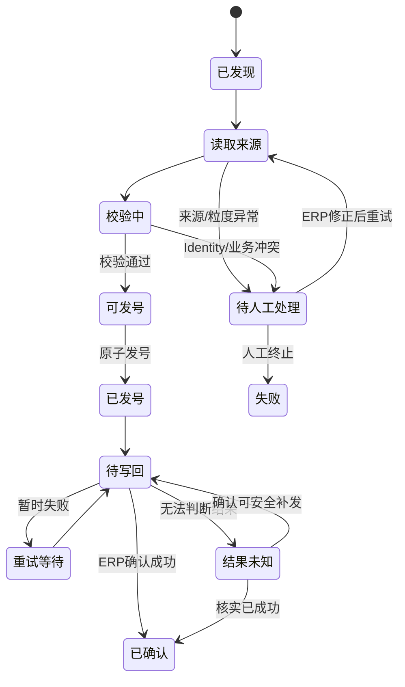
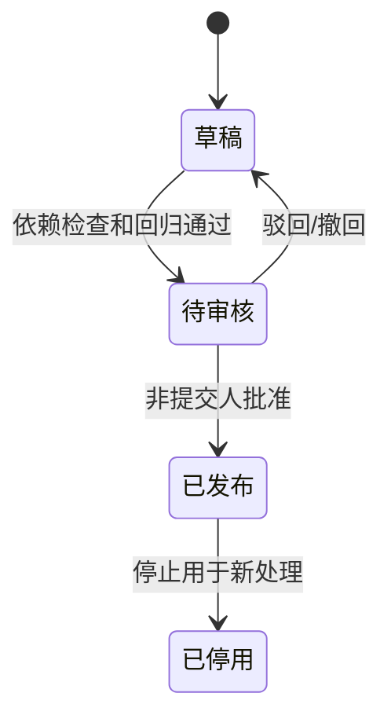
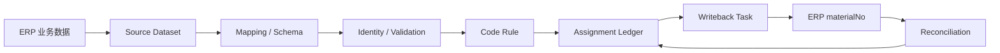

# 通用料号与物料主数据平台

**产品需求文档 PRD**

**版本：V3.0｜状态：评审稿｜ERP 驱动与多源数据集版**

修订日期：2026年10月6日

基线文档：通用料号与物料主数据平台 PRD V2.0（2026年10月6日）

面向产品评审、研发设计、测试验收、ERP/接口平台集成与实施交付。

---

## 文档摘要

V3.0 对 V2.0 的核心架构进行调整：**ERP 或企业现有业务系统是物料业务数据的事实源（System of Record，SoR）；MDM 不再承担完整物料 CRUD 主系统职责，而定位为“物料结构与编码标准化平台”**。

平台通过连接 ERP 数据库、只读视图、REST API、企业接口平台或文件接口，注册需要料号管理的 ERP 物料对象；通过导入 DDL、读取数据库元数据或导入接口 Schema 建立 Source Object；将单表或多张关联表组合为 Source Dataset；再通过字段映射形成统一 MDM Schema，并配置物料身份属性、校验规则、派生规则和料号规则。

业务用户仍在 ERP 中新建和维护物料。MDM 在后台识别待编号记录，读取其完整业务属性，完成规范化、校验和唯一性判断后生成料号，并通过 ERP 官方 API、企业接口平台或受控适配器写回 ERP。对于已经发放的料号，MDM 保存不可变的“发号账本”和规则快照，用于防重、追溯、解释和重试，但不把 MDM 中的同步快照视为 ERP 业务数据的替代权威源。

V3.0 特别解决如下现实场景：一个物料的料号并不只依赖一张 ERP 主表。例如玻璃布可能由“玻璃布主表、制造商表、表面处理表、布种基重表、幅宽表”等多张表共同决定。平台必须能定义这些表之间的关联关系，形成一个逻辑物料数据集，并以该数据集中的标准属性参与料号计算，而无需为玻璃布、铜箔、钢材、轴承等行业对象编写专用 Java 实体或专属编码代码。

---

## 文档导航

- [01 产品定位与目标](#01-产品定位与目标)
- [02 发布范围与基本假设](#02-发布范围与基本假设)
- [03 用户角色与端到端业务闭环](#03-用户角色与端到端业务闭环)
- [04 ERP 数据源、Source Object 与 DDL 导入](#04-erp-数据源source-object-与-ddl-导入)
- [05 Source Dataset 与多表关联模型](#05-source-dataset-与多表关联模型)
- [06 分类、Schema 与字段映射](#06-分类schema-与字段映射)
- [07 物料身份、校验与派生规则](#07-物料身份校验与派生规则)
- [08 料号生成、发号账本与历史解析](#08-料号生成发号账本与历史解析)
- [09 ERP 驱动的物料生命周期与同步](#09-erp-驱动的物料生命周期与同步)
- [10 多租户、权限与配置审批](#10-多租户权限与配置审批)
- [11 页面、查询与运行工作台](#11-页面查询与运行工作台)
- [12 数据归属、参考数据与变更策略](#12-数据归属参考数据与变更策略)
- [13 可靠同步、回写与对账](#13-可靠同步回写与对账)
- [14 对外接口契约](#14-对外接口契约)
- [15 数据模型与一致性约束](#15-数据模型与一致性约束)
- [16 业务记录、运行管理与安全边界](#16-业务记录运行管理与安全边界)
- [17 非功能指标与数据保留](#17-非功能指标与数据保留)
- [18 验收方案与追踪矩阵](#18-验收方案与追踪矩阵)
- [19 实施计划与交付物](#19-实施计划与交付物)
- [20 风险与待确认决策](#20-风险与待确认决策)
- [附录 A 玻璃布多表数据集完整示例](#附录-a-玻璃布多表数据集完整示例)
- [附录 B API 与任务示例](#附录-b-api-与任务示例)
- [附录 C 状态流转图](#附录-c-状态流转图)
- [附录 D 术语](#附录-d-术语)
- [附录 E V2.0 → V3.0 主要变更映射](#附录-e-v20--v30-主要变更映射)

### 需求标记

- **P0**：MVP 上线必须具备。
- **P1**：第二阶段增强。
- **P2**：有明确企业场景后评估。
- **FR**：功能需求。
- **BR**：业务规则。
- **NFR**：非功能要求。
- **AC**：验收用例。

V3.0 因产品边界与主流程发生实质变化，重新定义 FR、BR、AC 编号。旧版本编号不再直接代表同一语义；跨版本追踪见附录 E。

### 版本管理

|版本|日期|主要内容|
|---|---|---|
|V1.0|2026-09-26|建立元数据驱动、料号规则、物料主数据与企业集成框架|
|V2.0|2026-10-06|补齐多租户、成员角色、业务审批、运行与可靠投递|
|V3.0|2026-10-06|ERP 改为物料业务事实源；引入 Source Object、Source Dataset、多表关联、物料粒度/身份属性、DDL 导入、ERP 无感发号与回写|

---

# 01 产品定位与目标

## 1.1 背景与问题

企业已有 ERP、PLM、MES 或自研系统通常已经承担物料业务录入与维护职责。若再要求业务用户进入独立 MDM 重复创建物料，会形成双录、主数据归属争议、流程改造成本和同步冲突。因此，本产品不要求企业迁移原有物料创建入口。

另一方面，企业料号规则往往具有以下特点：

1. 不同行业、不同物料类别的字段完全不同。
2. 同一物料的编码字段可能分散在多张 ERP 表中。
3. 料号常由制造商、型号、表面处理、规格、幅宽、基重、等级、流水号等多种信息共同组成。
4. ERP 表结构与字段名属于企业实现细节，不应该直接固化成 MDM 的 Java 领域实体。
5. 企业希望继续在 ERP 中维护业务数据，同时把“料号应该怎么生成”集中到一个可配置、可版本化、可追溯的平台。

因此，V3.0 的核心问题不是“重新做一套 ERP 物料管理”，而是：

> **如何把企业已有系统中的任意物料数据，转换为一个可配置的逻辑物料模型，并稳定地生成、解释和回写料号。**

## 1.2 产品定位

本产品定位为：

> **通用物料标准化与料号治理平台。**

职责边界如下：

- ERP/PLM/企业业务系统：负责“企业当前有哪些物料、业务属性是什么、业务状态是什么”。
- MDM：负责“如何识别这些物料、如何将来源字段映射成标准属性、哪些属性决定物料身份、如何校验和标准化、如何生成料号、如何追溯历史规则”。
- MDM 生成的料号写回 ERP；ERP 继续作为业务操作入口。
- MDM 保存发号账本、规则版本、身份摘要和必要快照，用于唯一性、幂等、解释、审计和恢复。

## 1.3 核心设计原则

**P-01 ERP First**：物料业务数据默认以 ERP/既有业务系统为事实源，不要求业务用户在 MDM 重复维护。

**P-02 Metadata Driven**：类别、Schema、字段映射、数据集关联、身份属性和编码规则均配置化；新增行业不新增专用 Java 实体。

**P-03 Dataset Before Rule**：编码引擎只处理标准化后的 Dataset/Schema 属性，不直接依赖 ERP 表名、列名和 SQL。

**P-04 Identity Before Number**：先定义“什么组合代表一个物料”，再定义“这个物料如何编码”。料号是业务标识，不等同于物料身份本身。

**P-05 Immutable Published Configuration**：已发布的数据集、Schema、映射、身份定义和料号规则不可原地修改，变更通过新版本发布。

**P-06 No Silent Recode**：ERP 属性变化不自动修改已经发放的正式料号；涉及编码含义变化时进入异常或业务处理策略。

**P-07 Integration Safe**：读取优先使用只读权限；写回优先使用 ERP 官方 API、企业接口平台或受控业务接口，不默认直接 UPDATE ERP 业务表。

## 1.4 产品目标

|编号|目标|P0 衡量方式|
|---|---|---|
|G01|跨行业复用|配置玻璃布、轴承两类完全不同物料，不新增行业专用后端实体和编码分支|
|G02|支持 ERP 多表组合|玻璃布由主表与至少 4 张参考表构成，能形成单一 Dataset 并生成料号|
|G03|ERP 无感使用|业务人员只在 ERP 创建物料，MDM 自动发现、校验、发号并回写|
|G04|发号唯一可靠|并发、重试、回写超时场景不重复发号，不回收已发正式号|
|G05|规则可解释|任一料号可查到来源对象、Dataset、Schema、Identity、Rule 及当时编码输入快照|
|G06|源结构可治理|可导入 DDL/读取数据库元数据，识别表、列、主键、外键并生成 Source Object 草稿|
|G07|同步可恢复|ERP 短时不可用、网络超时、应用重启后能继续处理，不重复创建或覆盖错误记录|
|G08|多租户隔离|不同租户可对接不同 ERP、同名表和同料号规则，数据、配置和任务互不串租户|

## 1.5 系统边界

### 本平台负责

- 数据源与 ERP 对象注册。
- DDL/元数据导入。
- Source Dataset 设计和多表关联。
- 字段映射和单位/字典标准化。
- Category、Schema、Identity Attributes。
- 校验、派生和料号规则。
- 待编号记录发现、发号、写回、重试和对账。
- 发号账本、规则快照、同步快照和解释查询。
- 历史料号解析与迁移辅助。
- 多租户、配置审批、操作记录与运行工作台。

### 本平台不负责

- ERP 库存数量和库存交易。
- 采购订单、销售订单、成本核算。
- 完整 BOM 维护。
- 供应商资质审批。
- 替代 ERP 的通用物料 CRUD 页面。
- 未经业务明确授权的 ERP 数据直接写入。
- 自动决定企业“哪些表算物料”；需要管理员显式注册。

---

# 02 发布范围与基本假设

## 2.1 P0 范围

|能力|P0|后续|
|---|---|---|
|数据源|JDBC 数据库、REST/企业接口平台；连接测试与只读校验|P1 消息总线、CDC 专用连接器|
|结构导入|DDL 文本/文件导入；JDBC 元数据扫描|P1 OpenAPI/JSON Schema 自动建模增强|
|Source Object|表、视图、API 对象定义|P1 消息 Topic、复杂文件对象|
|Source Dataset|单表、多表 1:1/N:1 关联；主对象与物料粒度|P1 通用 1:N 聚合、复杂子查询图形编排|
|Schema|动态属性、单位、枚举、引用、版本|P1 对象/数组、多值属性|
|Identity|配置身份属性、规范化、唯一摘要|P1 模糊匹配与 Golden Record|
|规则|校验、派生、编码、历史解析|P1 复杂决策和脚本扩展沙箱|
|同步|定时增量、按条件扫描、REST 请求触发、失败重试|P1 CDC/Kafka|
|写回|REST/接口平台；受控适配器|P1 厂商专有 ERP 连接器|
|查询|发号记录、同步快照、规则解释、异常工作台|P1 搜索引擎与跨系统血缘图|
|多租户|租户、成员、角色、数据源/类别范围|P1 组织树、配额与计费|

## 2.2 技术基线

P0 建议采用模块化单体：Java/Spring Boot 服务端、Vue 3 前端、PostgreSQL 平台库。Redis 为可选缓存。Kafka、Debezium、OpenSearch 和 BPMN 不作为首版必需依赖。

外部数据库通过独立 Integration Adapter 访问；数据库凭据不进入业务 Schema。P0 不要求 MDM 与 ERP 使用同一种数据库。

## 2.3 数据源假设

1. ERP 至少能够提供一种稳定读取方式：只读表/视图、REST API 或企业接口平台。
2. 每个注册的物料对象必须有稳定来源主键，或由多个字段组成稳定来源键。
3. 增量轮询场景应尽量提供 `updated_at`、版本号、状态字段或等价游标；若无法提供，允许按“料号为空”等业务条件周期查询，但必须评估扫描成本。
4. 写回必须有可核验结果。若只得到 HTTP 接收成功而非业务成功，需要查询或回调确认。
5. 多表 Dataset 中，P0 的参考表关联主要用于 1:1 和 N:1 属性补充，不能因 JOIN 产生一条主物料对应多行且无法确定粒度。

## 2.4 MVP 试点建议

首批至少选择：

- **玻璃布**：验证主表 + 制造商 + 表面处理 + 基重 + 幅宽等多表组合。
- **另一种结构差异明显的物料**：如轴承、铜箔或钢材，验证平台并非为玻璃布硬编码。

至少接通一个真实 ERP 或企业接口平台，并完成从“ERP 创建未编号记录”到“MDM 回写正式料号”的业务 UAT。

---

# 03 用户角色与端到端业务闭环

## 3.1 角色与职责

|角色|职责|主要约束|
|---|---|---|
|平台管理员|租户开通、暂停、恢复、平台运行配置|默认不直接参与租户业务配置|
|租户管理员|成员、角色、数据源、类别范围、策略|只能管理本租户|
|数据源管理员|ERP 连接、DDL/元数据导入、Source Object|数据库凭据最小权限|
|模型设计员|Dataset、Schema、映射、Identity、规则草稿|发布前必须测试|
|配置审批员|审核并发布 Dataset/Schema/规则|不得审批自己提交的配置版本|
|集成管理员|同步策略、写回接口、重试、对账、异常处理|只能处理授权数据源与类别|
|业务观察员|查看发号结果、解释、同步状态|不直接修改规则|
|集成客户端|调用发号/查询接口|固定租户和授权对象范围|

V3.0 默认**不要求每一条 ERP 物料进入 MDM 人工审批**。人工审批重点从“物料记录审批”转为“配置发布审批”。企业如果确有合规要求，可为指定类别启用 P1 的记录级审批策略。

## 3.2 主要用户故事

**US01**：数据源管理员希望导入 ERP 玻璃布相关表的 DDL，自动识别列、主键和外键，减少手工重复录入。

**US02**：模型设计员希望把玻璃布主表与制造商、表面处理、基重和幅宽表组合成一个逻辑 Dataset，而不写专用 SQL/Java 代码。

**US03**：模型设计员希望把 ERP 列映射为 `manufacturer`、`treatment`、`basisWeight`、`width` 等稳定属性，并指定这些属性是否参与物料身份和料号。

**US04**：业务人员希望仍在 ERP 中创建物料，不需要进入 MDM；系统后台自动生成料号并回写。

**US05**：集成管理员希望看到某条物料为什么没有生成料号，是缺字段、关联不到参考数据、规则冲突还是 ERP 写回失败。

**US06**：审计或业务人员希望输入料号后看到当时用了哪个 ERP 来源、哪些字段、哪个规则版本生成。

## 3.3 标准端到端流程

```text
ERP 建立/修改业务记录
        ↓
MDM 发现候选记录
        ↓
Source Dataset 读取主表及关联参考数据
        ↓
字段映射 → MDM Schema
        ↓
规范化 / 校验 / 派生
        ↓
计算 Material Identity
        ↓
检查是否已发号 / 是否存在冲突
        ↓
根据 Code Rule 原子生成正式料号
        ↓
写入 MDM 发号账本（不可回收）
        ↓
通过 ERP API / 接口平台写回
        ↓
确认 ERP 已保存
        ↓
任务变为 CONFIRMED
```

## 3.4 失败分支

- 来源字段缺失：进入 `VALIDATION_FAILED`，不发号。
- JOIN 关联不到参考表：进入 `SOURCE_INCOMPLETE`。
- 一个来源键得到多条候选行：进入 `GRAIN_CONFLICT`。
- Identity 已对应另一来源物料：进入 `IDENTITY_CONFLICT`，禁止自动覆盖。
- 生成规则冲突：进入 `CODE_CONFLICT`。
- 已发号但写回失败：料号保持已占用，任务进入 `WRITEBACK_RETRY`，不得重新生成新号。
- 写回结果未知：进入 `RESULT_UNKNOWN`，先查询 ERP 结果，不能盲目重复写入。

---

# 04 ERP 数据源、Source Object 与 DDL 导入

## 4.1 数据源定义

**FR-01 P0**：租户可创建 `Source System`，至少包含：

- `sourceSystemId`
- `code`
- `name`
- `type`：DATABASE / REST / INTERFACE_PLATFORM / FILE
- `environment`：DEV / TEST / PROD 等
- `connectionProfile`
- `readOnly` 标记
- `timezone`
- `owner/contact`
- 状态：DRAFT / ACTIVE / SUSPENDED / RETIRED

数据库密码、Token 等敏感信息使用凭据引用保存，不回显明文。

## 4.2 Source Object

**FR-02 P0**：Source Object 表示外部系统中可读取的结构对象，例如：

- 数据库表 `GLASS_CLOTH`
- 数据库视图 `MDM_GLASS_CLOTH_V`
- REST 资源 `/materials/glass-cloth`
- 接口平台发布的数据对象

每个 Source Object 保存稳定对象 ID、来源系统、对象名、结构版本、字段、主键/唯一键、可增量字段及结构摘要。

## 4.3 DDL 导入

**FR-03 P0**：支持上传或粘贴 DDL，解析并生成 Source Object 草稿。至少识别：

- `CREATE TABLE`
- 列名、类型、长度、精度、可空性、默认值
- Primary Key
- Unique Key
- Foreign Key（DDL 中存在时）
- 基础字段注释（解析器支持时）

DDL 导入的目标是建立**来源结构元数据**，不是在 MDM 平台库中执行这些 DDL，也不是为 ERP 每张表复制建一张同构业务表。

**BR-01**：任何上传的 DDL 均只作为文本解析，不允许在平台数据库或 ERP 数据库自动执行。

## 4.4 JDBC 元数据读取

**FR-04 P0**：对于允许数据库连接的企业，数据源管理员可以通过 JDBC 元数据选择 Schema 和表/视图，直接导入列、主键和外键定义。读取使用只读账号；P0 不依赖数据库 DBA 权限。

若 DDL 与实时元数据同时存在，实时元数据生成新的结构快照，系统显示 Diff，由管理员决定是否创建新 Source Object Version。

## 4.5 结构版本与变更检测

**FR-05 P0**：每次正式使用的 Source Object 绑定不可变结构版本。发现以下变化时产生结构变更提醒：

- 字段新增/删除
- 类型、长度、精度变化
- nullability 变化
- 主键/唯一键变化
- 外键变化
- 来源对象被删除或失效

变化不得直接修改已发布 Dataset。管理员必须创建新版本并运行影响分析。

## 4.6 自动关系建议

**FR-06 P0**：如果导入 DDL/元数据中存在外键，平台自动给出 Dataset 关联建议。例如：

```text
GLASS_CLOTH.MANUFACTURER_ID
          → GLASS_MANUFACTURER.ID
```

没有外键时允许管理员手工选择两侧字段建立关联。平台只提供建议，不自动发布业务关系。

**AC-01**：导入玻璃布 5 张表 DDL 后，可正确展示字段、PK/FK，并建立 5 个 Source Object；不会在 MDM 平台库执行 ERP DDL。

---

# 05 Source Dataset 与多表关联模型

## 5.1 Dataset 定义

**FR-07 P0**：Source Dataset 是 MDM 读取某类物料时的逻辑输入模型。一个 Dataset 由以下内容组成：

- 一个 Root Object（主对象）
- 0..N 个关联 Source Object
- Join 定义
- Source Record Key
- Material Grain
- 增量读取策略
- 候选记录过滤条件
- 输出字段集合
- Dataset Version

例如：

```text
GLASS_CLOTH_DATASET
Root: GLASS_CLOTH g

LEFT JOIN GLASS_MANUFACTURER m
  ON g.MANUFACTURER_ID = m.ID
LEFT JOIN GLASS_TREATMENT t
  ON g.TREATMENT_ID = t.ID
LEFT JOIN GLASS_BASIS_WEIGHT bw
  ON g.BASIS_WEIGHT_ID = bw.ID
LEFT JOIN GLASS_WIDTH w
  ON g.WIDTH_ID = w.ID
```

## 5.2 Root Object 与 Source Record Key

**FR-08 P0**：每个 Dataset 必须指定 Root Object。Root Object 的主键或配置的稳定唯一键形成 `sourceRecordKey`，用于识别“ERP 中这一条业务记录”。

例如：

```text
sourceRecordKey = GLASS_CLOTH.ID
```

sourceRecordKey 与物料业务身份不同。前者回答“ERP 哪一行”，后者回答“这些属性是否代表同一个物料”。

## 5.3 Material Grain（物料粒度）

**FR-09 P0**：Dataset 必须声明 Material Grain。P0 默认“一条 Root Object 记录对应一个候选物料”。如果 JOIN 后同一 `sourceRecordKey` 产生多行，必须满足以下之一：

1. 关联关系本应为 1:1/N:1，重复属于数据异常，报 `GRAIN_CONFLICT`；
2. 企业改用已聚合的 ERP View；
3. P1 通过明确的子记录选择/聚合规则处理。

P0 不允许系统随机选择第一条子记录来生成料号。

## 5.4 Join 能力

**FR-10 P0**：Dataset Builder 支持：

- INNER JOIN
- LEFT JOIN
- 单字段等值关联
- 多字段组合等值关联
- 1:1、N:1 基础基数声明
- 空关联处理策略：ERROR / NULL / DEFAULT（仅允许显式配置）

P1 再支持通用 1:N 聚合、窗口函数、复杂表达式 Join。

## 5.5 ERP View 模式

**FR-11 P0**：平台允许把 ERP DBA 或接口团队提供的 View 作为单一 Source Object。对于特别复杂的 ERP 逻辑，优先允许企业在 ERP 侧建立稳定只读视图，例如 `MDM_GLASS_CLOTH_V`，MDM 不强制重建所有 Join。

View 模式与 Dataset Builder 模式最终都输出同一种逻辑 Dataset，不影响后续 Schema、Identity 和 Code Rule。

## 5.6 API Dataset

**FR-12 P0**：REST/接口平台可以直接返回逻辑物料对象。例如：

```json
{
  "id": "GC00001",
  "clothType": "7628",
  "manufacturerCode": "HONGHE",
  "treatmentCode": "A",
  "basisWeight": 210,
  "width": 1270,
  "materialNo": null,
  "updatedAt": "2026-10-06T06:00:00Z"
}
```

此时 Source Dataset 不要求知道 ERP 实际由几张表组成。

## 5.7 增量读取策略

**FR-13 P0**：每个 Dataset 选择一种或多种触发策略：

- `UPDATED_AT`：`updated_at > lastCursor`
- `VERSION_COLUMN`：版本字段递增
- `PENDING_PREDICATE`：如 `material_no IS NULL`
- `REQUEST_TRIGGER`：ERP/API 主动请求发号
- `MANUAL_RESCAN`：人工范围重扫

轮询任务记录持久化游标，进程重启后继续。

## 5.8 多表变化传播

**BR-02**：如果料号属性来自关联参考表，仅监控 Root Object 的 `updated_at` 可能漏掉参考表变化。P0 必须选择以下策略之一：

- ERP View 暴露能够反映依赖变化的统一版本/更新时间；
- 定期重扫所有“尚未发号”的 Root 记录；
- 针对参考表建立依赖重扫任务，变更后重新读取受影响 Root；
- 由 ERP/接口平台主动发送变更通知。

已经确认发号的物料即使参考表变化，也不得自动重新编码，见第 09 章。

## 5.9 Dataset 预览

**FR-14 P0**：发布 Dataset 前可选择样本 `sourceRecordKey` 运行预览，展示：

- Root 记录
- 每个 Join 命中情况
- 最终扁平输出
- 重复行数量
- null 字段
- 数据类型
- 增量字段值
- 预计映射后的 Schema 输入

**AC-02**：玻璃布主表 + 4 个参考表能稳定输出“一条 Root 记录 → 一条 Dataset 记录”；制造商关联缺失时能定位到具体 Join。

---

# 06 分类、Schema 与字段映射

## 6.1 Category

**FR-15 P0**：Category 用于表示平台中的逻辑物料类别，如 `GLASS_CLOTH`、`COPPER_FOIL`、`BEARING`。Category 与 ERP 表名解耦，同一个 Category 可以在不同租户映射到不同 ERP 对象。

Category code 在租户内唯一，发布后不可改义；需要改变业务语义时新建 Category 或版本化迁移。

## 6.2 Attribute Definition

**FR-16 P0**：属性定义支持：STRING、INTEGER、DECIMAL、BOOLEAN、DATE、ENUM、REFERENCE，包含：

- `code`
- 名称与描述
- 类型
- 长度/精度/范围
- 单位维度
- 字典或引用目标
- 是否可搜索
- 是否参与 Identity
- 是否允许参与 Code Rule
- 展示分组

属性 code 表达稳定业务语义，不直接使用 ERP 列名作为永久语义。

## 6.3 Schema Version

**FR-17 P0**：每个可编号 Category 绑定发布的 Schema Version。Schema Version 固定属性版本、约束、单位语义和可参与规则的字段集合。已发布版本只读。

## 6.4 Field Mapping

**FR-18 P0**：Field Mapping 将 Dataset 输出字段映射为 Schema 属性，例如：

|MDM 属性|Dataset 来源|
|---|---|
|`clothType`|`g.CLOTH_TYPE`|
|`manufacturer.code`|`m.CODE`|
|`treatment.code`|`t.CODE`|
|`basisWeight`|`bw.WEIGHT`|
|`width`|`w.WIDTH`|
|`existingMaterialNo`|`g.MATERIAL_NO`|

映射支持字段直取、常量、字典映射、单位转换、基本格式转换和有限组合表达式。

## 6.5 类型与单位规范化

**FR-19 P0**：DECIMAL 使用十进制精确语义。单位转换后保存规则执行所需的标准值，同时在发号快照中保留来源原值和来源单位。禁止使用二进制浮点参与唯一性和编码关键计算。

## 6.6 映射版本

**BR-03**：发布后的 Field Mapping 不允许原地编辑。新 Dataset/Schema/Mapping 版本不会自动改变已发号记录的历史解释。

**AC-03**：不同 ERP 字段名均可映射为同一 `GLASS_CLOTH` Schema；后端编码引擎不出现 `GLASS_CLOTH_TABLE` 等行业专用分支。

---

# 07 物料身份、校验与派生规则

## 7.1 两种身份

V3.0 明确区分：

1. **Source Record Identity**：ERP 中是哪一条记录，通常由来源主键决定。
2. **Material Identity**：哪些规范化业务属性组合起来代表“同一个物料”。

例如玻璃布：

```text
Source Record Identity = GLASS_CLOTH.ID

Material Identity =
manufacturer
+ clothType
+ treatment
+ basisWeight
+ width
```

## 7.2 Identity Attributes

**FR-20 P0**：模型设计员可以从 Schema 中勾选 Identity Attributes，并定义：

- 字段顺序
- null 是否允许
- 字符串 trim/case 规范化
- 数值标准单位
- 枚举使用 code 而非显示名
- Reference 使用稳定业务 key 或映射 code

系统将规范化后的 Identity 生成 `identityCanonical` 和 `identityHash`。

**BR-04**：identityHash 只作为高效索引，不替代完整 canonical 值比对。哈希碰撞场景仍以规范化字段值判断。

## 7.3 Identity 冲突

**FR-21 P0**：同一租户、同一 Category 下，如果两个不同 `sourceRecordKey` 得到相同 Material Identity，系统不得自动判断谁覆盖谁。进入 `IDENTITY_CONFLICT`，展示两侧来源数据供人工核对。

企业可在实施阶段明确“同一业务物料允许 ERP 多行别名”的特殊策略，但 P0 默认一对一。

## 7.4 校验规则

**FR-22 P0**：规则使用结构化表达式，支持 eq、ne、gt、gte、lt、lte、in、and、or、not、exists、基本四则运算以及已注册单位/字典/引用函数。

处理顺序：

```text
Dataset 原始数据
→ Field Mapping
→ 类型转换
→ 单位规范化
→ 默认值
→ 派生属性
→ Schema 校验
→ 业务校验
→ Identity 计算
→ Code Rule
```

## 7.5 派生规则

**FR-23 P0**：派生属性可以由多个标准属性计算，但客户端/ERP 不能伪造 MDM 内部派生结果。规则依赖图必须无环。

## 7.6 错误模型

每条业务错误至少包含：

- `sourceRecordKey`
- `fieldPath`
- `code`
- `message`
- `ruleVersion`
- `sourceValue`
- `suggestion`

错误分为 ERROR 与 WARNING。ERROR 阻止发号；WARNING 可继续但必须记录。

**AC-04**：改变玻璃布幅宽、厂商、基重等 Identity 属性可得到不同 Identity；仅修改备注等非 Identity 属性不会改变 Identity。

---

# 08 料号生成、发号账本与历史解析

## 8.1 Code Rule

**FR-24 P0**：Code Rule 由有序 Segment 组成，Segment 至少支持：

- 常量
- Schema 属性
- 字典映射值
- Reference 编码值
- 数值格式化
- 单位转换后格式化
- 序列/流水号
- 分隔符

料号最大长度默认 128 字符；字符集、大小写规范和 trim 策略在租户规则中固定。

## 8.2 预览

**FR-25 P0**：配置测试和 API 可执行 preview。Preview 不占正式流水，不写发号账本。含序列时显示占位符。

## 8.3 正式发号

**FR-26 P0**：只有通过 Dataset、Mapping、Schema、Validation、Identity 全部检查的记录才能进入正式发号。

正式发号事务至少完成：

1. 锁定该 Source Record/Identity 的发号请求；
2. 检查是否已有 Assignment；
3. 检查 Identity 冲突；
4. 原子获取序列（如有）；
5. 生成 materialNo；
6. 检查租户内唯一性；
7. 写入不可变 Assignment/Fulfillment 记录；
8. 创建 Writeback Task。

ERP 回写可以在事务后异步执行，但**已经成功发放的料号不因回写失败而回收**。

## 8.4 发号账本（Material Number Ledger）

**FR-27 P0**：MDM 保存料号发放账本，至少包含：

- `assignmentId`
- `tenantId`
- `sourceSystemId`
- `datasetVersionId`
- `sourceRecordKey`
- `categoryId`
- `schemaVersionId`
- `mappingVersionId`
- `identityCanonical`
- `identityHash`
- `codeRuleVersionId`
- `materialNo`
- `numberSource`：GENERATED / LEGACY
- `inputSnapshot`
- `issuedAt`
- `issueRequestId`
- `writebackStatus`
- `erpConfirmedAt`

该账本是“MDM 是否发放过某个号码及其依据”的权威记录，但不是 ERP 业务物料数据的替代主表。

## 8.5 幂等

**BR-05**：相同 `tenant + dataset + sourceRecordKey + generationIntent` 的重复请求返回原 Assignment。回写重试复用同一个 materialNo，不重新发号。

## 8.6 已存在 ERP 料号

**FR-28 P0**：如果 Dataset 中 `existingMaterialNo` 已有值，按配置执行：

- `IGNORE_EXISTING`：不重新发号，仅记录观察结果；
- `IMPORT_AS_LEGACY`：校验后导入为历史 Assignment；
- `VERIFY_EXISTING`：按当前或指定历史规则比对并产生差异；
- `ERROR`：要求人工处理。

默认禁止直接覆盖 ERP 已有非空料号。

## 8.7 历史料号解析

**FR-29 P0**：保留 V2 的显式解析能力。用户指定 Parse Rule Version 后，可将旧料号解析为属性候选；解析结果不自动修改 ERP，也不自动证明业务真实性。

**AC-05**：100 个并发待编号来源记录不会产生重复正式料号；同一来源记录重复触发只返回同一 Assignment；回写失败后再次执行仍使用原号。

---

# 09 ERP 驱动的物料生命周期与同步

## 9.1 生命周期核心变化

V3.0 不再以 `DRAFT → IN_REVIEW → ACTIVE` 作为 MDM 物料主生命周期。物料业务生命周期属于 ERP。

MDM 管理的是**发号处理生命周期**：

|状态|含义|
|---|---|
|DISCOVERED|发现符合候选条件的 ERP 来源记录|
|READING|正在读取 Dataset 和关联数据|
|VALIDATING|映射、校验、派生和 Identity 计算|
|REVIEW_REQUIRED|存在需要人工处理的业务冲突|
|READY|可正式发号|
|ISSUED|正式料号已写入 MDM 发号账本|
|WRITEBACK_PENDING|等待写回 ERP|
|WRITEBACK_RETRY|写回暂时失败等待重试|
|RESULT_UNKNOWN|ERP 是否成功未知，需要查询/人工核实|
|CONFIRMED|ERP 已确认保存料号|
|FAILED|永久失败或人工终止|
|IGNORED|按策略不处理|

## 9.2 候选记录条件

**FR-30 P0**：每个 Dataset 可配置候选条件，例如：

```text
MATERIAL_NO IS NULL
AND STATUS = 'ACTIVE'
AND ITEM_TYPE = 'GLASS_CLOTH'
```

也可以不依赖 SQL 表达式，而由 API 返回“待编号”集合。

候选条件必须使用安全的结构化过滤器或受控查询模板，不向业务用户开放任意 SQL 执行入口。

## 9.3 ERP 修改非编码属性

**BR-06**：如果 ERP 已发号记录只修改非 Identity、非编码依赖属性，MDM 更新最后同步快照和观察版本，不改变 materialNo。

## 9.4 ERP 修改编码/Identity 属性

**BR-07**：如果 ERP 已确认发号后，又修改 Identity 属性或 Code Rule 依赖字段，系统不得自动生成新号覆盖旧号。任务进入 `IDENTITY_CHANGED_AFTER_ISSUE`，根据类别策略执行：

- 仅告警，不自动处理；
- 要求 ERP 建立新物料记录；
- 进入人工变更工作台；
- P1 企业自定义重编码流程。

P0 默认建议：**规格实际变成另一种物料时，在 ERP 新建物料记录并重新申请料号。**

## 9.5 ERP 删除/停用

**FR-31 P0**：来源记录删除或停用不会删除 MDM 发号账本。MDM 记录最后观察状态。已发正式号码永不因来源删除而自动释放给其他物料。

## 9.6 同步快照

**FR-32 P0**：MDM 可保存 `material_source_snapshot`，用于工作台展示和追溯。该快照至少保存：

- 来源记录键
- 最后读取时间
- 来源版本/更新时间
- 标准化属性
- Identity
- materialNo
- Dataset/Schema/Mapping 版本

快照明确标记 `NON_AUTHORITATIVE_COPY`，不能成为独立业务编辑入口。

## 9.7 主动请求模式

**FR-33 P0**：ERP 能改造接口时，可在创建物料过程中同步或异步调用 MDM：

```text
ERP → POST /material-number-assignments
    → MDM 校验/发号
    → 返回 materialNo
    → ERP 自己保存
```

此模式与轮询模式共用 Dataset/Schema/Identity/Code Rule 和发号账本，不形成两套规则。

**AC-06**：ERP 中一条玻璃布记录从 MATERIAL_NO 为空开始，在不登录 MDM 的情况下最终获得料号；MDM 可完整展示处理链路。

---

# 10 多租户、权限与配置审批

## 10.1 租户生命周期

**FR-34 P0**：保留 V2 多租户能力。Tenant 状态为 DRAFT、ACTIVE、SUSPENDED、ARCHIVED。暂停租户后停止新的扫描、发号和写回；正在执行的原子本地事务允许完成，外部结果未知任务进入核对状态。

## 10.2 租户隔离

**FR-35 P0**：以下对象必须有 tenantId：

- Source System
- Source Object / Version
- Dataset / Version
- Category / Schema
- Mapping
- Identity Definition
- Validation/Derivation/Code Rule
- Assignment Ledger
- Snapshot
- Sync/Writeback Task
- Reconciliation Job
- Operation Log

共享单位等平台公共基础数据单独建模，不通过其他租户数据共享。

## 10.3 权限

**FR-36 P0**：权限至少区分：

- 数据源查看/编辑
- DDL/元数据导入
- Dataset 设计
- Schema 设计
- Identity 配置
- Rule 设计
- 配置提交/审批/发布
- 手工重扫
- 手工发号（默认关闭）
- 写回重试
- 结果核对
- 对账
- 查询与导出

## 10.4 配置审批

**FR-37 P0**：Dataset、Schema、Mapping、Identity、Code Rule 等组合形成 Release Package。状态：

```text
DRAFT → REVIEW → PUBLISHED → RETIRED
```

发布前必须完成：

- 依赖完整性检查
- Source Object 版本固定
- Dataset 样本预览
- Mapping 覆盖率
- Identity 样本唯一性检查
- Code Rule 回归样本
- 写回字段与接口契约检查

提交人与最终审批人不得是同一成员。

## 10.5 运行策略变更

**BR-08**：修改轮询频率、超时等纯运行参数可以独立版本化；任何可能改变“同一输入生成什么料号”的配置必须进入 Release Package 审批，不允许普通设置即时覆盖。

**AC-07**：两个租户可各自注册名为 `GLASS_CLOTH` 的 ERP 表、Category 和相同料号，不发生跨租户冲突。


# 11 页面、查询与运行工作台

## 11.1 页面清单

|页面|主要内容|关键反馈|
|---|---|---|
|工作台|当前租户、待处理异常、写回失败、最近发号、结构变更|按严重级别和来源系统聚合|
|数据源管理|Source System、连接测试、凭据引用、状态|只读/写回能力分开展示|
|Source Object|DDL 导入、JDBC 元数据、字段/PK/FK、结构 Diff|明确当前结构版本|
|Dataset Builder|Root、Join、Grain、输出字段、增量策略|预览 Join 命中和重复行|
|Category / Schema|属性、单位、字典、引用、搜索属性|草稿与已发布版本分离|
|Field Mapping|Dataset 字段到 Schema 属性|缺失必填映射、类型冲突|
|Identity 设计|身份属性、规范化规则、样本冲突|展示 canonical/hash 结果|
|Code Rule|编码 Segment、流水、预览样本|预览不占号|
|Release Package|依赖版本、测试结果、提交/审批/发布|影响范围与版本 Diff|
|发号记录|来源键、Identity、料号、规则版本、写回状态|可查看完整解释链|
|同步任务|扫描、读取、校验、发号、写回任务|错误阶段明确，不统一显示“失败”|
|异常中心|Identity 冲突、Grain 冲突、来源缺失、写回未知|支持核对和受控恢复|
|对账中心|ERP 料号与 MDM Ledger 对比|差异类型和处理建议|
|运行监控|延迟、积压、失败率、连接状态|按租户/来源/Dataset 过滤|

## 11.2 Dataset Builder 交互

**FR-38 P0**：Dataset Builder 至少支持以下交互：

1. 选择 Root Object；
2. 通过已识别 FK 或手工字段新增 Join；
3. 声明 1:1/N:1 预期基数；
4. 选择输出字段；
5. 定义 Source Record Key；
6. 设置候选过滤器；
7. 设置增量游标；
8. 选取真实样本预览；
9. 展示 SQL/请求计划的只读解释；
10. 保存为 Dataset 草稿。

前端不得允许普通设计员提交任意数据库写 SQL。复杂 SQL 可通过 DBA 建 View 或由受控管理员模板解决。

## 11.3 发号解释页

**FR-39 P0**：从任一 `materialNo` 或 `assignmentId` 可查看：

```text
Source System
→ Source Object Version
→ Dataset Version
→ sourceRecordKey
→ 原始输入快照
→ Field Mapping Version
→ 标准化属性
→ Identity Definition Version
→ identityCanonical
→ Validation Result
→ Code Rule Version
→ Segment 明细
→ materialNo
→ Writeback Task
→ ERP 确认结果
```

该页面是平台核心可解释能力，不得只展示最终料号。

## 11.4 查询要求

**FR-40 P0**：支持按以下条件查询发号记录：

- materialNo 精确查询
- sourceSystem
- sourceRecordKey
- Category
- Dataset
- Identity 属性（已声明 searchable）
- issuedAt 范围
- writebackStatus
- errorCode

动态属性筛选只允许已发布的合法字段和运算符，不接受任意 SQL。

## 11.5 手工操作边界

P0 页面可以提供：重扫、重新校验、重新写回、确认外部已成功、标记需人工处理等动作。

P0 默认不提供“直接编辑 ERP 物料属性”的通用页面，也不允许用户在 MDM 中随意改 `materialNo`。

---

# 12 数据归属、参考数据与变更策略

## 12.1 数据归属模型

V3.0 明确区分“业务数据权威”“规则权威”“发号权威”。

|数据类别|权威系统/权威方|说明|
|---|---|---|
|ERP 物料业务记录|ERP/PLM/业务系统|名称、规格、来源业务状态等以来源系统为准|
|库存、成本、采购等交易属性|ERP/WMS|MDM 不维护|
|Category / Schema|MDM|平台配置权威|
|Dataset / Mapping|MDM|描述如何读取和解释来源数据|
|Identity Definition|MDM|定义业务物料唯一粒度|
|Validation / Derivation / Code Rule|MDM|规则权威|
|正式料号的“发放事实”|MDM Assignment Ledger|记录何时、依据什么规则发放过该号|
|业务系统当前 materialNo 字段|ERP|回写确认后，ERP 作为业务使用入口|
|同步快照|MDM 非权威副本|仅用于追踪、解释、搜索、对账|

这里不存在简单的“料号到底只属于一个系统”的二选一：**MDM 是发号权威，ERP 是业务持有与使用系统。** 两者通过 Assignment 和 Writeback Confirmation 保持一致。

## 12.2 参考数据来源

制造商、表面处理、幅宽、基重等信息可能出现两种模式：

### 模式 A：ERP 参考表为事实源

例如：

```text
GLASS_MANUFACTURER
GLASS_TREATMENT
GLASS_BASIS_WEIGHT
GLASS_WIDTH
```

MDM 通过 Dataset Join 读取这些表的 code/name/value，不要求复制为 MDM 可编辑参考主表。

### 模式 B：MDM 管理编码映射

当 ERP 只有业务值，但料号要求另一套编码值时，MDM 可维护版本化 Lookup Mapping，例如：

```text
ERP manufacturer_id = M001
→ business name = 宏和
→ code segment = HH
```

此映射属于 MDM 编码配置，必须随 Release Package 发布。

## 12.3 来源参考表改名

**BR-09**：显示名称变化不应自动改变已发料号。已发号记录保留当时编码输入快照。

如果参与 Code Rule 的稳定编码值发生变化，例如制造商编码从 `HH` 改为 `HONGHE`，新规则/新映射必须通过新版本发布；历史 Assignment 仍按旧版本解释。

## 12.4 来源表结构变化

**FR-41 P0**：结构变化产生 Impact Report，至少列出：

- 受影响 Dataset
- 受影响 Field Mapping
- 受影响 Schema 属性
- 受影响 Identity
- 受影响 Code Rule
- 最近成功同步时间
- 待处理未发号数量

结构变化不会自动修改已发布配置。

## 12.5 来源数据异常

如果参考表出现：

- 外键指向不存在记录
- code 为空
- 同一个 ID 出现重复业务定义
- 字典 code 不唯一

则错误必须定位为“来源数据问题”或“关联问题”，不能统一包装为编码规则异常。

**AC-08**：修改制造商显示名称不改变历史料号解释；删除制造商关联记录后，新待编号记录进入明确的 `SOURCE_INCOMPLETE`。

---

# 13 可靠同步、回写与对账

## 13.1 扫描任务

**FR-42 P0**：每个 Dataset 可配置扫描任务。任务记录：

- `scanJobId`
- tenant
- datasetVersion
- schedule/trigger
- cursorBefore/cursorAfter
- scannedCount
- discoveredCount
- skippedCount
- failedCount
- startedAt/finishedAt

游标仅在符合一致性策略的范围内推进；失败记录必须能单独恢复，不能因一条数据异常阻塞整个 Dataset 永久停止。

## 13.2 发号与写回分离

**BR-10**：正式发号本地事务与外部 ERP 写回分离。原因是外部请求不可纳入平台数据库事务。

正确顺序：

```text
校验成功
→ 本地原子发号 + Assignment Ledger
→ 创建 Writeback Task
→ 提交事务
→ 调 ERP
→ 确认结果
```

禁止：

```text
先写 ERP
→ 再尝试写 MDM Ledger
```

否则平台崩溃时可能出现 ERP 有料号但 MDM 不知道已发放。

## 13.3 Writeback Adapter

**FR-43 P0**：写回通道优先级：

1. ERP 官方 REST/SOAP API；
2. 企业自研接口平台；
3. ERP 提供的受控存储过程/业务接口；
4. 直接数据库 UPDATE 仅作为企业明确授权的例外方案，不作为平台默认方式。

每个 Adapter 必须声明：

- 目标操作
- 身份键
- materialNo 目标字段
- 幂等键能力
- 成功响应判定
- 查询结果能力
- 超时
- 重试策略

## 13.4 Writeback 状态

|状态|含义|动作|
|---|---|---|
|PENDING|已创建待写回|后台领取|
|SENDING|正在调用目标|持有任务租约|
|WAIT_CONFIRMATION|目标已接收但业务结果未确认|回调/轮询|
|RETRY_WAIT|可重试错误|按计划重试|
|RESULT_UNKNOWN|无法判断目标是否成功|先查询或人工核实|
|SUCCEEDED|ERP 已确认保存同一料号|更新 Assignment 确认时间|
|FAILED|永久失败/次数耗尽|异常中心|

## 13.5 幂等与重试

**FR-44 P0**：写回使用稳定幂等键，例如：

```text
tenantId + assignmentId + targetSystemId
```

建议重试计划：1 分钟、5 分钟、30 分钟、2 小时，最多自动重试 4 次（不含首次）。429 尊重合理的 Retry-After。

如果目标不支持幂等，必须提供“按 sourceRecordKey 查询当前 materialNo”的能力。两者都没有时，超时进入 RESULT_UNKNOWN，不自动连续重放。

## 13.6 防止覆盖 ERP 人工值

**BR-11**：写回前再次读取或带版本条件验证：

- 如果 ERP materialNo 仍为空：允许写入；
- 如果等于本 Assignment materialNo：视为幂等成功；
- 如果已经是其他非空值：禁止覆盖，进入 `ERP_VALUE_CONFLICT`。

## 13.7 对账

**FR-45 P0**：支持手工和每日对账，至少检查：

- Assignment 已 ISSUED 但 ERP 仍为空；
- ERP materialNo 与 Ledger 不一致；
- ERP 有料号但 Ledger 无记录；
- 同一 materialNo 对应多个 Identity；
- 同一 sourceRecordKey 出现多个有效 Assignment；
- 长期 RESULT_UNKNOWN；
- Dataset 已停用但仍有运行任务。

对账只生成差异和恢复动作，不自动篡改历史 Ledger。

## 13.8 Outbox

**FR-46 P0**：平台内部发号完成、写回任务创建、操作日志写入在同一数据库事务中完成。可使用 Outbox 表驱动后台 Worker，P0 无需 Kafka。

**AC-09**：在“Ledger 已提交、ERP 调用前”杀死进程，重启后仍能从 PENDING 恢复并写回；不会重新发一个新号码。

---

# 14 对外接口契约

## 14.1 API 前缀

公共接口建议使用 `/api/v1`。PRD 文档版本 V3.0 不要求 API 主版本同步升级；只有存在不兼容协议变更时才升级 API 主版本。

## 14.2 管理 API

|方法|路径|语义|
|---|---|---|
|GET/POST|`/source-systems`|查询/创建数据源|
|POST|`/source-systems/{id}/test`|连接测试|
|POST|`/source-objects:import-ddl`|导入 DDL 形成对象草稿|
|POST|`/source-systems/{id}/discover`|读取 JDBC 元数据|
|GET/POST|`/datasets`|Dataset 列表/草稿创建|
|POST|`/datasets/{id}:preview`|运行样本预览|
|GET/POST|`/categories`|类别管理|
|GET/POST|`/schemas`|Schema 草稿/查询|
|GET/POST|`/mappings`|Field Mapping|
|GET/POST|`/identity-definitions`|Identity 定义|
|GET/POST|`/code-rules`|料号规则|
|POST|`/release-packages/{id}:submit`|提交配置审核|
|POST|`/release-packages/{id}:approve`|审批并发布|

## 14.3 发号 API

**FR-47 P0**：提供统一发号接口，既能被 ERP 主动调用，也能被内部扫描 Worker 调用。

```http
POST /api/v1/material-number-assignments
X-Tenant-Code: TENANT-A
Idempotency-Key: erp-gc-100001-create
Content-Type: application/json
```

请求可以只给来源身份：

```json
{
  "datasetCode": "GLASS_CLOTH_DATASET",
  "sourceRecordKey": "100001"
}
```

平台自行读取 Dataset。

如果企业采用 API Push，也可提交已签约的 Dataset 输入：

```json
{
  "datasetCode": "GLASS_CLOTH_API_DATASET",
  "sourceRecordKey": "100001",
  "sourceVersion": "88",
  "payload": {
    "clothType": "7628",
    "manufacturerCode": "HONGHE",
    "treatmentCode": "A",
    "basisWeight": 210,
    "width": 1270
  }
}
```

返回示例：

```json
{
  "assignmentId": "asn_01J...",
  "sourceRecordKey": "100001",
  "materialNo": "GC-7628-A-210-1270-HH",
  "status": "ISSUED",
  "writebackStatus": "PENDING",
  "schemaVersion": 3,
  "codeRuleVersion": 7,
  "requestId": "req_01J..."
}
```

## 14.4 预览 API

```http
POST /api/v1/material-numbers:preview
```

Preview 返回：标准化属性、Identity、Segment 明细、候选料号和 warnings，但不创建 Assignment，不占流水。

## 14.5 解释 API

```http
GET /api/v1/material-number-assignments/by-no/{materialNo}
```

返回发号链路及允许查看的规则解释。

## 14.6 任务 API

|方法|路径|语义|
|---|---|---|
|POST|`/datasets/{id}:scan`|手工触发重扫|
|GET|`/scan-jobs/{id}`|扫描结果|
|GET|`/writeback-tasks/{id}`|写回状态|
|POST|`/writeback-tasks/{id}:retry`|授权重试|
|POST|`/writeback-tasks/{id}:confirm`|人工核对确认|
|POST|`/reconciliation-jobs`|启动对账|

## 14.7 一致性与错误码

写接口使用 Idempotency-Key。配置更新使用 ETag/If-Match 或等价版本条件。

建议状态码：

- 400：结构错误/租户未选择
- 403：权限或类别范围不匹配
- 404：资源不存在
- 409：版本、Identity、Code、ERP 值冲突
- 422：业务校验失败
- 428：缺少版本条件
- 429：限流
- 503：外部依赖不可用

核心业务错误码至少包括：

```text
SOURCE_INCOMPLETE
SOURCE_OBJECT_CHANGED
GRAIN_CONFLICT
MAPPING_ERROR
VALIDATION_ERROR
IDENTITY_CONFLICT
IDENTITY_CHANGED_AFTER_ISSUE
CODE_CONFLICT
ASSIGNMENT_ALREADY_EXISTS
ERP_VALUE_CONFLICT
WRITEBACK_TIMEOUT
RESULT_UNKNOWN
```

---

# 15 数据模型与一致性约束

## 15.1 逻辑实体

|实体组|主要对象|关键约束|
|---|---|---|
|租户与权限|tenant、business_user、tenant_member、role、role_action|租户隔离|
|数据源|source_system、credential_ref|凭据与业务配置分离|
|来源结构|source_object、source_object_version、source_field、source_relation|结构版本不可变|
|数据集|source_dataset、dataset_version、dataset_join、dataset_output_field|必须有 Root、Source Key、Grain|
|模型|category、attribute_definition_version、schema_version|稳定业务语义|
|映射|field_mapping_version、lookup_mapping_version|发布版本不可变|
|身份|identity_definition_version、identity_field|规范化唯一语义|
|规则|validation_rule、derivation_rule、code_rule_version、parse_rule_version|显式版本|
|配置发布|release_package、release_approval|依赖版本一起发布|
|发号|material_assignment、assignment_input_snapshot|料号租户唯一；同来源幂等|
|同步快照|material_source_snapshot|非权威副本|
|任务|scan_job、processing_task、writeback_task|状态可恢复|
|可靠性|outbox_event、idempotency_record、task_lease|防重复与崩溃恢复|
|对账|reconciliation_job、reconciliation_diff|不直接修改历史|
|操作记录|business_operation_log|关联 traceId/对象/版本|

## 15.2 Source Object Version

至少包含：

```text
id
sourceSystemId
objectType
objectName
schemaName
structureHash
versionNo
status
importMethod (DDL/JDBC/API)
createdAt
publishedAt
```

字段实体保存 sourceName、dataType、length、precision、nullable、primaryKeyOrder、comment 等。

## 15.3 Dataset Version

至少包含：

```text
id
tenantId
datasetCode
rootObjectVersionId
sourceKeyDefinition
grainDefinition
filterDefinition
incrementalStrategy
cursorDefinition
status
versionNo
```

Join 单独保存左右对象、左右字段、joinType、expectedCardinality 和 nullPolicy。

## 15.4 Material Assignment

`material_assignment` 是 V3.0 最核心业务实体之一，建议至少包含：

```text
id
tenantId
sourceSystemId
datasetVersionId
sourceRecordKey
categoryId
schemaVersionId
mappingVersionId
identityDefinitionVersionId
identityCanonical
identityHash
codeRuleVersionId
materialNo
numberSource
assignmentStatus
writebackStatus
sourceVersion
issuedAt
erpConfirmedAt
rowVersion
createdAt
```

唯一约束至少包括：

1. `(tenantId, materialNo)` 唯一；
2. 同一有效 Dataset 来源记录只能有一个正式 Assignment；
3. 默认 `(tenantId, categoryId, identityCanonical)` 业务唯一，具体允许策略由 Category 定义；
4. 请求幂等键有数据库唯一约束。

## 15.5 Input Snapshot

发号时必须保存最少充分输入快照，包含：

- Dataset 输出原值（参与规则的字段）
- 标准化 Schema 值
- Identity 值
- 每个 Code Segment 的输入/输出
- 相关 Lookup Mapping Version

不要求把整个 ERP 行及无关敏感字段永久复制到 MDM。

## 15.6 强一致与最终一致

### 必须本地强一致

- materialNo 唯一性
- Source Record 的幂等发号
- Identity 冲突判断所需索引
- Assignment Ledger
- Code Sequence 占用
- Outbox/Writeback Task 创建

### 与 ERP 最终一致

- materialNo 写回结果
- ERP 当前业务状态
- MDM 同步快照
- 对账状态

## 15.7 流水号

流水作用域固定为：

```text
tenant + codeRuleVersion + sequenceName + periodKey
```

允许断号，不允许回绕，不回收已发号码。若按日/年重置，周期信息必须由规则保证全局料号仍满足企业唯一性策略。

**AC-10**：数据库并发测试证明唯一约束不是只靠“先查再插”；两个 Worker 同时处理同一来源记录只能提交一个 Assignment。

---

# 16 业务记录、运行管理与安全边界

## 16.1 操作记录

**FR-48 P0**：记录以下关键动作：

- Source System 创建/停用
- DDL/元数据导入
- Source Object Version 变化
- Dataset/Schema/Mapping/Identity/Rule 发布
- 手工扫描
- 正式发号
- 手工异常处理
- 写回重试/人工确认
- 对账处理
- 租户/成员/角色变化

记录对象、版本、操作者/客户端、UTC 时间、原因、Diff、traceId。

## 16.2 运行指标

**FR-49 P0**：至少展示：

- Dataset 扫描延迟
- 待处理候选数量
- VALIDATION_FAILED 数量
- IDENTITY_CONFLICT 数量
- 发号成功率
- 发号 P95
- Writeback P95
- Writeback 失败率
- RESULT_UNKNOWN 数量
- 最老待写回任务年龄
- ERP 连接健康状态
- 对账差异数
- 数据库锁等待

## 16.3 凭据与网络安全边界

- 数据库读取账号默认只读。
- 写回账号与读取账号分离。
- 凭据存储采用 Secrets/Vault/环境安全配置，不落普通业务表明文。
- 数据源连接需要租户范围和来源白名单。
- DDL 文本只解析不执行。
- Dataset Builder 不向普通用户开放任意 SQL。
- 日志禁止打印数据库密码、Token 和完整敏感连接串。

## 16.4 任务租约

后台 Worker 领取任务时使用数据库租约/状态锁。Worker 异常退出后，租约超时可由其他实例恢复。`SENDING` 不等于失败，恢复前必须按照目标幂等能力判断是否可安全重试。

---

# 17 非功能指标与数据保留

以下为评审建议值，最终需要结合真实 ERP、数据库与部署环境压测确认。

|编号|指标|P0 建议验收条件|
|---|---|---|
|NFR-01|容量|单租户至少 100 万 Assignment；200 Category；每 Category 多版本配置|
|NFR-02|并发发号|20 次正式发号/秒混合负载，无重复号|
|NFR-03|同步扫描|5 万候选记录本地校验/映射在 10 分钟量级完成，外部查询耗时单列|
|NFR-04|交互性能|普通配置/详情查询 P95 ≤ 1 秒，复杂 Dataset 预览除外|
|NFR-05|发号接口|数据已就绪且不含慢外部查询时，P95 ≤ 1 秒；ERP 查询耗时单列|
|NFR-06|写回时效|目标健康时，ISSUED → CONFIRMED P95 ≤ 60 秒|
|NFR-07|可用性|月度 99.9% 目标，维护窗口另计|
|NFR-08|灾备|建议 RPO ≤ 15 分钟、RTO ≤ 4 小时|
|NFR-09|浏览器|企业基线 Chrome/Edge；中文界面|
|NFR-10|可观测|所有发号/写回链路可用 requestId/traceId 串联|

## 17.1 数据保留

建议：

- Material Assignment Ledger：长期保留，原则上不按普通日志清理。
- 发布的 Schema/Rule/Dataset/Mapping Version：只要仍被 Assignment 引用就不得清理。
- Input Snapshot：至少满足企业追溯周期，建议 3 年起评审。
- Operation Log：建议 3 年。
- 完整外部请求/响应报文：默认 30 天，可脱敏。
- Writeback 成功元数据：至少 180 天；Ledger 中保留最终确认摘要。
- Idempotency Record：接口最短承诺 7 天；业务 Assignment 唯一性永久兜底。
- DDL 上传原文与结构快照：保留发布版本相关记录。

## 17.2 降级

- ERP 读取不可用：停止新发现，不影响已存在 Ledger 查询。
- ERP 写回不可用：继续保留 ISSUED，积压 Writeback Task，不重新发号。
- Redis 不可用：回源 PostgreSQL。
- 某一 Dataset 异常：不阻断其他 Dataset。
- 配置发布失败：旧 PUBLISHED 版本继续运行。

---

# 18 验收方案与追踪矩阵

## 18.1 核心端到端样例：玻璃布

租户 A 的 ERP 中存在：

- `GLASS_CLOTH` 主表
- `GLASS_MANUFACTURER` 制造商表
- `GLASS_TREATMENT` 表面处理表
- `GLASS_BASIS_WEIGHT` 布种基重表
- `GLASS_WIDTH` 幅宽表

管理员导入 DDL，建立 Source Object；以 `GLASS_CLOTH` 为 Root 创建 Dataset，并通过外键/手工关系关联其余 4 表。

ERP 新增：

```text
GLASS_CLOTH.ID = 100001
CLOTH_TYPE = 7628
MANUFACTURER_ID = M01
TREATMENT_ID = T01
BASIS_WEIGHT_ID = BW210
WIDTH_ID = W1270
MATERIAL_NO = NULL
```

Dataset 输出：

```json
{
  "sourceRecordKey": "100001",
  "clothType": "7628",
  "manufacturerCode": "HH",
  "treatmentCode": "A",
  "basisWeight": 210,
  "width": 1270,
  "materialNo": null
}
```

Identity 定义：

```text
manufacturerCode + clothType + treatmentCode + basisWeight + width
```

Code Rule：

```text
GC-{clothType}-{treatmentCode}-{basisWeight}-{width}-{manufacturerCode}
```

生成：

```text
GC-7628-A-210-1270-HH
```

MDM 写入 Assignment Ledger，并通过 ERP 接口写回 `GLASS_CLOTH.MATERIAL_NO`。最终 ERP 查询到同一号码，任务 CONFIRMED。

## 18.2 第二类别通用性样例

租户 A 或 B 再配置轴承：

```text
BEARING
+ BRAND
+ PRECISION
+ SEAL_TYPE
```

Schema 属性为内径、外径、宽度、精度、密封、品牌；编码规则与玻璃布完全不同。要求后端无新增 `if category == BEARING` 的行业编码逻辑。

## 18.3 验收矩阵

|用例|对应需求|最小通过标准|
|---|---|---|
|AC-01 结构导入|FR-01—06|DDL/JDBC 正确生成 Source Object，不执行 DDL|
|AC-02 多表 Dataset|FR-07—14|玻璃布 5 表输出稳定单行，关联异常可定位|
|AC-03 Schema/Mapping|FR-15—19|不同 ERP 字段映射为稳定业务属性|
|AC-04 Identity|FR-20—23|身份属性变化影响 Identity，非身份属性不影响|
|AC-05 发号|FR-24—29|并发不重号、重复请求不重发、历史可解释|
|AC-06 ERP 无感|FR-30—33|只在 ERP 新建也能最终获得料号|
|AC-07 多租户与发布|FR-34—37|配置/数据/任务隔离，发布不可原地改|
|AC-08 数据归属|FR-41、BR-09|参考数据变化不破坏历史解释|
|AC-09 可靠写回|FR-42—46|崩溃/超时恢复不产生新号|
|AC-10 数据一致性|第15章|数据库唯一约束和任务租约有效|
|AC-11 API|FR-47|主动发号、预览、解释、任务接口契约一致|
|AC-12 运维|FR-48—49、NFR|链路可追踪、指标可观测、恢复演练通过|
|AC-13 身份变更保护|BR-07|已发号后修改编码属性不自动重编码|
|AC-14 ERP 值保护|BR-11|ERP 已有其他非空料号时禁止覆盖|

## 18.4 发布门槛

P0 发布必须满足：

1. AC-01—14 全部通过；
2. 至少一个真实 ERP/接口平台完成写回 UAT；
3. 玻璃布多表 Dataset 端到端通过；
4. 第二类结构差异明显的物料证明无行业硬编码；
5. 并发发号测试无重复号码；
6. Ledger 提交后模拟进程崩溃，任务可恢复；
7. ERP 超时/结果未知场景不会盲目重发；
8. 数据库备份恢复后 Assignment、Sequence、Pending Writeback 一致；
9. 配置发布、回退和结构变更影响分析完成演练。

---

# 19 实施计划与交付物

## 19.1 建议实施节奏

以 2 后端、1 前端、1 测试，加共享产品/架构/ERP 接口支持为参考，建议 12—16 周评估。ERP 环境、真实表结构和接口若不能及时提供，排期顺延。

|阶段|参考周次|交付与退出条件|
|---|---|---|
|M0 业务与来源梳理|1—2|确认 ERP SoR、试点物料、5 表玻璃布结构、料号规则、写回方式|
|M1 Source Metadata|2—4|Source System、DDL/JDBC 导入、Source Object、结构 Diff|
|M2 Dataset & Schema|3—6|Dataset Builder、Join、Grain、Mapping、Schema、样本预览|
|M3 Identity & Numbering|5—8|Identity、校验、派生、Code Rule、Ledger、并发唯一性|
|M4 ERP Sync|7—11|增量扫描、发号任务、Writeback Adapter、重试和结果确认|
|M5 Workbench & Governance|9—13|发布审批、异常中心、解释页、对账、多租户、监控|
|M6 UAT & Hardening|12—16|真实 ERP 试点、第二类别验证、压测、恢复演练、上线手册|

若只有 1 后端 + 1 前端，建议重新估算至约 18—24 周，不应在不减范围的情况下沿用多人配置工期。

## 19.2 产品交付

- PRD V3.0
- 试点 ERP 表结构与关系说明
- 玻璃布 Dataset 业务定义
- Category / Schema / Identity / Code Rule 样本
- 页面交互说明
- 配置审批矩阵
- ERP 数据归属矩阵

## 19.3 研发交付

- 模块化后端源码
- 前端管理台
- PostgreSQL migration
- DDL/Metadata Importer
- Dataset Engine
- Mapping/Normalization Engine
- Identity Engine
- Validation/Derivation Engine
- Code Engine
- Assignment Ledger
- Polling/Request Trigger
- Writeback Adapter SPI
- Outbox/Task Worker
- Reconciliation Service
- OpenAPI
- 可复现部署说明

## 19.4 测试交付

- PRD → Test Case 追踪矩阵
- DDL 解析样本
- Dataset Join 正反例
- Grain 冲突样本
- Identity 冲突样本
- 100+ 并发发号测试
- 幂等/进程崩溃测试
- ERP 超时/重复/未知结果测试
- 结构变化 Diff 测试
- 多租户隔离测试
- 压测和恢复报告

## 19.5 上线策略

推荐：

1. 先只读连接生产影子数据或脱敏副本；
2. 验证 Dataset 输出与人工现有料号规则一致；
3. 开启 Preview/Verify 模式，不回写；
4. 选择有限物料类别灰度发号；
5. 开启 Writeback；
6. 观察对账和异常；
7. 再扩大 Category 范围。

回退应用版本时，已发放的 Assignment 和号码不能删除/回收。若已经写回 ERP，回退不能仅靠恢复旧数据库备份造成双方不一致。

---

# 20 风险与待确认决策

## 20.1 主要风险

|风险|表现|应对|
|---|---|---|
|ERP 表结构高度耦合|升级 ERP 后 Dataset 失效|Source Object Version + Schema Diff + 发布影响分析|
|多表 Join 粒度不清|一条主物料被 JOIN 成多行|必须声明 Root/Grain，P0 限制 1:1/N:1|
|参考表变化未触发主表 updated_at|待编号记录读取到旧数据|View 统一版本、依赖重扫或通知机制|
|业务身份定义错误|不同物料误认为同一物料|Identity 回归样本 + 冲突工作台 + 发布审批|
|编码规则只覆盖部分属性|不同 Identity 生成同号|materialNo 唯一约束 + CODE_CONFLICT，不自动加后缀|
|ERP 不支持幂等|超时可能重复写|查询当前值，未知结果人工确认|
|直接写数据库风险|绕过 ERP 业务逻辑|默认 API/接口平台，直写仅例外授权|
|历史参考数据改义|旧料号无法解释|Assignment Input Snapshot + Mapping/Rule Version|
|过度通用化|Dataset Builder 变成 SQL IDE|P0 严格限定 Join/表达式，复杂逻辑交给 View|
|来源记录被修改|已发料号语义发生变化|IDENTITY_CHANGED_AFTER_ISSUE，不自动重编码|
|DDL 解析方言差异|复杂 Oracle/MySQL DDL 解析失败|P0 支持核心语法 + JDBC 元数据兜底 + 手工修正草稿|

## 20.2 必须在实施前确认

|决策|V3.0 建议默认|最晚时点|
|---|---|---|
|D01 物料 SoR|ERP/现有业务系统|M0|
|D02 MDM 定位|规则、身份、发号与同步平台，不做完整 ERP 替代|M0|
|D03 首批 Dataset|玻璃布 5 表 + 第二类不同结构物料|M0|
|D04 来源读取|优先只读 View/JDBC 或企业 API|M0|
|D05 写回方式|优先 ERP API/企业接口平台|M0|
|D06 直接 DB 写回|默认禁止，仅企业明确授权例外|M0|
|D07 物料粒度|Root 行默认对应一个物料；特殊 1:N 另设计|M1|
|D08 Identity|业务确认哪些属性决定“同一种物料”|M2|
|D09 已有料号处理|默认不覆盖，可 VERIFY/LEGACY Import|M2|
|D10 已发号后属性改变|默认告警并要求 ERP 建新物料，不自动重编码|M2|
|D11 配置审批|规则/映射发布需双人分工；单条物料默认不人工审批|M1|
|D12 同步触发|轮询为 P0；有条件时支持 ERP 主动 API|M3|
|D13 参考表变更传播|优先 View 统一更新时间或依赖重扫|M2|
|D14 保留期|Ledger 长期；规则版本随引用保留|M0|

## 20.3 V3.0 评审结论要求

只有以下核心问题形成明确结论，PRD 才能从“评审稿”进入“已确认”：

1. ERP 是否正式认定为试点物料 SoR；
2. 玻璃布实际表结构、PK/FK 和字段样本是否提供；
3. 哪些表/对象属于需要 MDM 管料号的物料对象；
4. 玻璃布真实 Material Identity 是哪些属性；
5. 正式料号规则与历史料号兼容策略；
6. MDM 回写 ERP 的合法接口；
7. ERP 已发号记录修改规格时的业务处理原则。

---

# 附录 A 玻璃布多表数据集完整示例

> 本附录为架构示例，表名和字段名应以企业真实 ERP 为准。

## A1 假设 ERP 表

### 玻璃布主表

```sql
CREATE TABLE GLASS_CLOTH (
    ID                VARCHAR2(32) PRIMARY KEY,
    CLOTH_TYPE        VARCHAR2(50) NOT NULL,
    MANUFACTURER_ID   VARCHAR2(32) NOT NULL,
    TREATMENT_ID      VARCHAR2(32),
    BASIS_WEIGHT_ID   VARCHAR2(32),
    WIDTH_ID          VARCHAR2(32),
    MATERIAL_NO       VARCHAR2(128),
    STATUS            VARCHAR2(20),
    UPDATE_TIME       TIMESTAMP
);
```

### 制造商表

```sql
CREATE TABLE GLASS_MANUFACTURER (
    ID      VARCHAR2(32) PRIMARY KEY,
    CODE    VARCHAR2(20) NOT NULL,
    NAME    VARCHAR2(200) NOT NULL
);
```

### 表面处理表

```sql
CREATE TABLE GLASS_TREATMENT (
    ID      VARCHAR2(32) PRIMARY KEY,
    CODE    VARCHAR2(20) NOT NULL,
    NAME    VARCHAR2(200)
);
```

### 布种基重表

```sql
CREATE TABLE GLASS_BASIS_WEIGHT (
    ID          VARCHAR2(32) PRIMARY KEY,
    WEIGHT      NUMBER(10, 3) NOT NULL,
    UNIT_CODE   VARCHAR2(20) DEFAULT 'g/m2'
);
```

### 幅宽表

```sql
CREATE TABLE GLASS_WIDTH (
    ID          VARCHAR2(32) PRIMARY KEY,
    WIDTH       NUMBER(10, 3) NOT NULL,
    UNIT_CODE   VARCHAR2(20) DEFAULT 'mm'
);
```

实际企业 DDL 若存在 Foreign Key，平台可自动建议关联；若没有 FK，管理员手工定义。

## A2 Dataset

```text
Dataset Code: GLASS_CLOTH_DATASET
Root Object: GLASS_CLOTH
Source Key: GLASS_CLOTH.ID
Grain: ONE_ROOT_ROW_ONE_MATERIAL

Join 1:
GLASS_CLOTH.MANUFACTURER_ID = GLASS_MANUFACTURER.ID
Expected Cardinality: N:1
Null Policy: ERROR

Join 2:
GLASS_CLOTH.TREATMENT_ID = GLASS_TREATMENT.ID
Expected Cardinality: N:1
Null Policy: ERROR

Join 3:
GLASS_CLOTH.BASIS_WEIGHT_ID = GLASS_BASIS_WEIGHT.ID
Expected Cardinality: N:1
Null Policy: ERROR

Join 4:
GLASS_CLOTH.WIDTH_ID = GLASS_WIDTH.ID
Expected Cardinality: N:1
Null Policy: ERROR
```

## A3 Dataset 输出字段

```text
sourceRecordKey     = g.ID
clothType           = g.CLOTH_TYPE
manufacturerCode    = m.CODE
manufacturerName    = m.NAME
treatmentCode       = t.CODE
basisWeightValue    = bw.WEIGHT
basisWeightUnit     = bw.UNIT_CODE
widthValue          = w.WIDTH
widthUnit           = w.UNIT_CODE
existingMaterialNo  = g.MATERIAL_NO
sourceUpdatedAt     = g.UPDATE_TIME
```

## A4 MDM Schema

```json
{
  "category": "GLASS_CLOTH",
  "attributes": {
    "clothType": {"type": "STRING", "required": true},
    "manufacturer": {"type": "STRING", "required": true},
    "treatment": {"type": "STRING", "required": true},
    "basisWeight": {"type": "DECIMAL", "unit": "g/m2", "required": true},
    "width": {"type": "DECIMAL", "unit": "mm", "required": true}
  }
}
```

## A5 Field Mapping

```text
clothType      ← clothType
manufacturer   ← manufacturerCode
treatment      ← treatmentCode
basisWeight    ← { value: basisWeightValue, unit: basisWeightUnit }
width          ← { value: widthValue, unit: widthUnit }
```

## A6 Identity

```text
Identity Fields:
1. manufacturer
2. clothType
3. treatment
4. basisWeight(normalized g/m2)
5. width(normalized mm)
```

标准化示例：

```text
manufacturer = HH
clothType = 7628
treatment = A
basisWeight = 210 g/m2
width = 1270 mm

identityCanonical =
GLASS_CLOTH|HH|7628|A|210|1270
```

## A7 Code Rule

```text
Segment 1 = CONST("GC")
Segment 2 = ATTRIBUTE(clothType)
Segment 3 = ATTRIBUTE(treatment)
Segment 4 = NUMBER(basisWeight, scale=0)
Segment 5 = NUMBER(width, scale=0)
Segment 6 = ATTRIBUTE(manufacturer)
Separator = "-"
```

结果：

```text
GC-7628-A-210-1270-HH
```

## A8 ERP 回写

推荐：

```http
PATCH /erp/materials/glass-cloth/100001
Idempotency-Key: assignment-id
```

```json
{
  "materialNo": "GC-7628-A-210-1270-HH"
}
```

目标返回当前版本和最终业务结果。MDM 确认后把 Writeback 标记为 SUCCEEDED。

## A9 为什么不在 MDM 建 5 张同构业务表

因为这些 ERP 表是“来源系统的存储实现”，不是 MDM 的业务领域边界。平台只保存：

- Source Object 元数据
- Dataset 关系定义
- Mapping/Schema/Identity/Rule
- Assignment Ledger
- 必要同步快照

未来另一个 ERP 即使使用完全不同的表名和拆表方式，也可以映射到同一个 `GLASS_CLOTH` Schema，而无需修改编码引擎。

---

# 附录 B API 与任务示例

## B1 Assignment 查询

```json
{
  "assignmentId": "asn-100001",
  "source": {
    "system": "ERP01",
    "dataset": "GLASS_CLOTH_DATASET",
    "sourceRecordKey": "100001",
    "sourceVersion": "2026-10-06T06:00:00Z"
  },
  "category": "GLASS_CLOTH",
  "identity": {
    "canonical": "GLASS_CLOTH|HH|7628|A|210|1270"
  },
  "materialNo": "GC-7628-A-210-1270-HH",
  "ruleVersions": {
    "dataset": 3,
    "schema": 4,
    "mapping": 2,
    "identity": 2,
    "codeRule": 7
  },
  "status": "ISSUED",
  "writeback": {
    "status": "SUCCEEDED",
    "confirmedAt": "2026-10-06T06:01:03Z"
  }
}
```

## B2 Validation Error

```json
{
  "code": "VALIDATION_ERROR",
  "message": "待编号记录未通过业务校验",
  "traceId": "trace-001",
  "sourceRecordKey": "100001",
  "errors": [
    {
      "fieldPath": "/width",
      "code": "OUT_OF_RANGE",
      "sourceValue": -10,
      "ruleVersion": 4,
      "message": "幅宽必须大于 0",
      "suggestion": "请在 ERP 修正幅宽后重新同步"
    }
  ]
}
```

## B3 Source Incomplete

```json
{
  "code": "SOURCE_INCOMPLETE",
  "message": "制造商参考数据不存在",
  "sourceRecordKey": "100001",
  "join": {
    "left": "GLASS_CLOTH.MANUFACTURER_ID",
    "leftValue": "M01",
    "right": "GLASS_MANUFACTURER.ID"
  }
}
```

---

# 附录 C 状态流转图

## C1 发号处理



## C2 配置发布



## C3 ERP 数据与 MDM 责任关系



---

# 附录 D 术语

|术语|含义|
|---|---|
|SoR|System of Record，某类业务数据的事实来源系统|
|Source System|ERP、PLM、接口平台等外部来源系统|
|Source Object|来源系统中的表、视图、API 对象等结构单元|
|Source Object Version|某次稳定的来源结构快照|
|Source Dataset|由一个 Root 和若干关联对象组成的逻辑物料输入|
|Root Object|决定 Dataset 主粒度的来源对象|
|Source Record Key|ERP 中一条来源记录的稳定身份|
|Material Grain|Dataset 中“一行代表什么物料”的粒度定义|
|Category|MDM 中稳定的逻辑物料类别|
|Schema|标准物料属性结构|
|Field Mapping|来源字段到标准属性的映射|
|Material Identity|用于判断是否为同一种业务物料的规范化属性组合|
|Identity Canonical|Identity 属性按规则规范化后的完整可比较表示|
|Code Rule|由属性、常量、映射、流水等组成的料号生成规则|
|Assignment|MDM 对某一来源/Identity 正式发放料号的记录|
|Assignment Ledger|所有正式发号事实及其规则依据的持久账本|
|Input Snapshot|发号时实际参与 Identity/规则的输入快照|
|Writeback|把 MDM 已发料号写回 ERP 的动作|
|Reconciliation|比较 ERP 当前值与 MDM Ledger 的对账过程|
|Release Package|一起发布的 Dataset、Schema、Mapping、Identity、Rule 版本集合|
|Non-authoritative Snapshot|为查询和追溯保存的来源副本，不作为业务事实源|

---

# 附录 E V2.0 → V3.0 主要变更映射

|主题|V2.0|V3.0|
|---|---|---|
|物料事实源|MDM 平台维护权威动态属性|ERP/既有业务系统为物料业务 SoR|
|业务入口|在 MDM 创建草稿、审批、生效|业务人员继续在 ERP 创建/维护|
|MDM 角色|物料主数据平台 + 编码 + 同步|物料标准化、Identity、编码、发号和同步平台|
|ERP 关系|MDM 生效后向 ERP 推送|ERP 产生候选物料，MDM 发号后回写 ERP|
|物料生命周期|DRAFT/IN_REVIEW/ACTIVE/INACTIVE|生命周期归 ERP；MDM 管发号任务状态|
|审批|单条物料默认审批|配置发布默认审批，单条物料人工处理仅用于异常/可选策略|
|数据结构|MDM `material.attributes` 为权威 JSONB|Source Dataset 映射到 Schema；Snapshot 为非权威副本|
|外部表结构|普通集成映射|新增 Source Object、DDL/JDBC 元数据导入|
|多表物料|未作为核心模型|Source Dataset 原生支持 Root + 多表 1:1/N:1 Join|
|业务唯一性|动态业务唯一键|明确 Material Identity 与 Source Record Identity 两层|
|料号发放|首次批准时占号|校验通过后原子写 Assignment Ledger|
|同步失败|出站 Delivery 重试|发号与 Writeback 分离；已发号码不因回写失败回收|
|历史解释|Schema/Rule 快照|增加 Dataset/Mapping/Identity/Input Snapshot 全链路解释|
|ERP 已有号|历史导入|VERIFY / LEGACY / IGNORE / ERROR 明确策略|
|已发号后规格变化|MDM 变更流程|ERP 变化触发异常，P0 不自动重编码|

---

# 文档结束

本 PRD V3.0 的首要验证不是“能不能在 MDM 页面创建一条物料”，而是：

> **面对一个真实企业 ERP，即使某类物料由多张关系表共同组成，平台仍能通过配置把它抽象为稳定 Dataset 和 Schema，识别物料身份，可靠生成唯一料号，并在不改变业务人员 ERP 操作习惯的前提下完成回写与追溯。**

